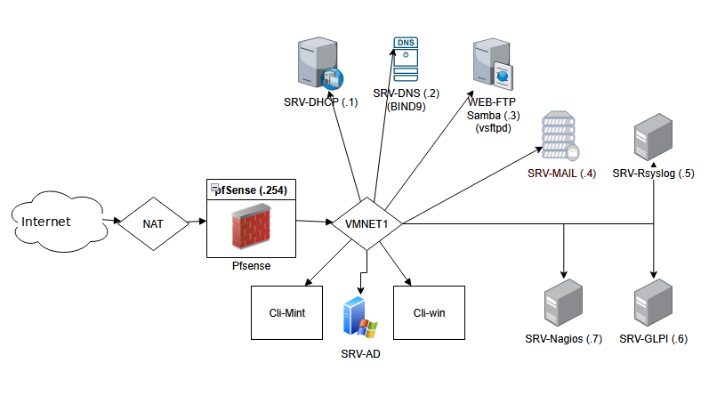

# Documentation Technique

*Déploiement d’une Infrastructure Réseau Virtualisée sous Linux avec pfSense et Services Intégrés*

## Contenu

- [Réseau : pfSense, DHCP et clients](reseau-pfsense-dhcp.md) - Configuration du pare-feu pfSense (interfaces, NAT, règles), serveur DHCP Debian et intégration des clients.
- [Services Linux : DNS, FTP, web, fichiers, messagerie, logs](services-linux.md) - BIND9, vsftpd en FTPS, Apache2 et ses hôtes virtuels, Samba, Postfix/Dovecot avec RainLoop, centralisation des logs (rsyslog, MySQL, LogAnalyzer).
- [GLPI : déploiement, inventaire et Active Directory](glpi-parc.md) - LAMP, installation de GLPI, agent d'inventaire Windows et Linux, intégration LDAP/Active Directory, synchronisation, déploiement par GPO et configuration SMTP.
- [Supervision : Nagios et NRPE](supervision-nagios.md) - Installation de Nagios Core, plugins, interface web, puis supervision distante de SRV-Mail via NRPE.

| Rédigé par | Illyes Zerga |
|---|---|
| Date | 22/07/25 |

## Diagramme du projet

## Objectif

Mettre en œuvre une infrastructure réseau virtualisée sécurisée à base de pfSense et Debian, intégrant des services essentiels tels que DHCP, DNS, FTP(S), serveur Web Apache2, messagerie Postfix/Dovecot, centralisation de logs, GLPI (avec LDAP et inventaire automatisé), ainsi que la supervision via Nagios.

## Prérequis

 Environnement de virtualisation : VMware Workstation ou équivalent

 Réseau interne VMNET1 : sous-réseau 10.10.10.0/24

 Accès root ou sudo sur toutes les machines Debian

 Machines virtuelles nécessaires :

pfSense (2.7.2 ou supérieur) avec deux interfaces :

WAN : en mode NAT (fournie par VMware)

LAN : en mode VMNET1 (réseau privé)

Serveurs Debian 10/11/12 pour :

Services réseau : DHCP, DNS (Bind9), FTP(S), Apache2, Postfix/Dovecot

GLPI et MariaDB

Centralisation des logs avec rsyslog et LogAnalyzer

Supervision avec Nagios et NRPE

Clients Windows et Linux (VM sur VMNET1) pour :

Tests DHCP

Connexions Samba, FTP(S)

Remontée des logs et inventaire GLPI

Intégration à un domaine AD

Contrôleur de domaine Active Directory (`<SERVEUR>`) sous Windows Server

Pour LDAP, GPO, et déploiement d’agents GLPI
