# GLPI : déploiement, inventaire et Active Directory

## Sommaire

- [12. Installation d’un environnement LAMP pour GLPI](#12-installation-dun-environnement-lamp-pour-glpi)
  - [12.1 Installation d’Apache2, PHP et MariaDB](#121-installation-dapache2-php-et-mariadb)
- [13. Installation de GLPI](#13-installation-de-glpi)
  - [13.1 Installation via navigateur :](#131-installation-via-navigateur)
  - [13.2 Première connexion](#132-première-connexion)
- [14. Inventaire Automatique avec GLPI Agent](#14-inventaire-automatique-avec-glpi-agent)
  - [14.1 Activation de l’inventaire automatique dans GLPI](#141-activation-de-linventaire-automatique-dans-glpi)
  - [14.2 Installation de l’agent sur Windows](#142-installation-de-lagent-sur-windows)
  - [14.3. Installation de l’agent sur Linux](#143-installation-de-lagent-sur-linux)
- [15 Intégration d'un annuaire Active Directory dans GLPI via LDAP](#15-intégration-dun-annuaire-active-directory-dans-glpi-via-ldap)
  - [15.1 Objectif](#151-objectif)
  - [15.2 Création de l'annuaire LDAP dans GLPI](#152-création-de-lannuaire-ldap-dans-glpi)
  - [15.3 Importer les utilisateurs depuis l’Active Directory](#153-importer-les-utilisateurs-depuis-lactive-directory)
- [16. Activer la synchronisation automatique LDAP](#16-activer-la-synchronisation-automatique-ldap)
- [17. Déploiement de l’agent GLPI via GPO sur ton `<SERVEUR>`](#17-déploiement-de-lagent-glpi-via-gpo-sur-ton-serveur)
  - [17.1 Préparer le fichier MSI](#171-préparer-le-fichier-msi)
  - [17.2 Créer un script de déploiement silencieux](#172-créer-un-script-de-déploiement-silencieux)
  - [17.3 Créer une GPO de démarrage](#173-créer-une-gpo-de-démarrage)
  - [17.3 Vérification](#173-vérification)
- [18. Configuration SMTP dans GLPI](#18-configuration-smtp-dans-glpi)
## 12. Installation d’un environnement LAMP pour GLPI

Avant d’installer GLPI, assurez-vous que votre serveur Debian dispose d’un environnement LAMP (Linux, Apache, MariaDB, PHP) fonctionnel.

### 12.1 Installation d’Apache2, PHP et MariaDB

- **Mettre à jour les paquets :**

```bash
apt update && apt upgrade -y
```

- **Installer Apache2 :**

```bash
apt install apache2 -y
```

- Vérifiez le service :

```bash
systemctl status apache2
```

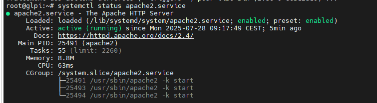

- **Installer PHP :**

```bash
apt install php -y
```

- Vérifiez la version :

```
php -v
```

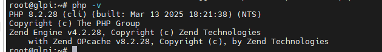

- **Installer****MariaDB****:**

```bash
apt install mariadb-server -y
```

Vérifiez le service :

```bash
systemctl status mariadb
```

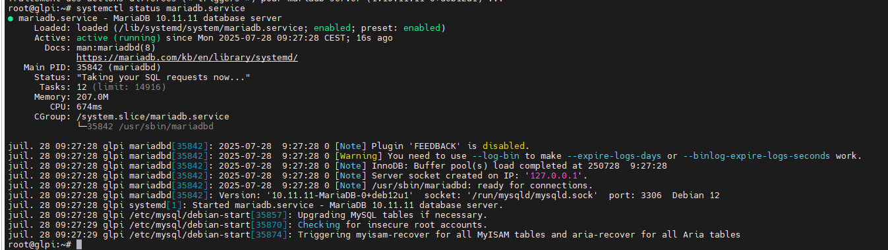

- **Créer la base GLPI et l’utilisateur :**

```
mariadb -u root
CREATE DATABASE glpi;
CREATE USER 'glpibdd'@'localhost' IDENTIFIED BY '<MOT_DE_PASSE>';
GRANT ALL PRIVILEGES ON glpi.* TO 'glpibdd'@'localhost';
FLUSH PRIVILEGES;
EXIT;
```

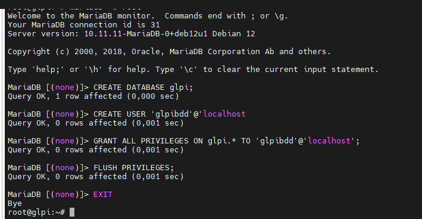

- **Redémarrer****MariaDB****:**

```bash
systemctl restart mariadb
```

## 13. Installation de GLPI

Une fois le LAMP en place, installez GLPI :

- Installer les dépendances PHP pour GLPI :

```bash
apt install php-ldap php-imap php-apcu php-cas php-mbstring php-curl php-gd perl php-zip php-intl php-bz2 php-mysql php-xml -y
systemctl reload apache2
```

- Télécharger et déployer GLPI :

```bash
cd /usr/src
wget https://github.com/glpi-project/glpi/releases/download/10.0.18/glpi-10.0.18.tgz
```

```
tar -zxvf glpi-10.0.18.tgz
```

```bash
mv glpi/* /var/www/html/
rm /var/www/html/index.html
chown -R www-data:www-data /var/www/html
systemctl restart apache2
```

### 13.1 Installation via navigateur :

On va maintenant se connecter à GLPI via le navigateur et finaliser son installation.

- Ouvrez votre navigateur sur http://`<IP_SERVEUR>` ici 10.10.10.6
- Sélectionner Français puis OK

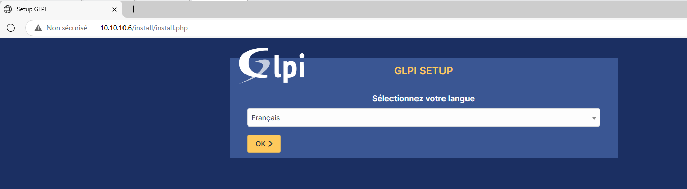

- Acceptez les conditions puis **Continuer**

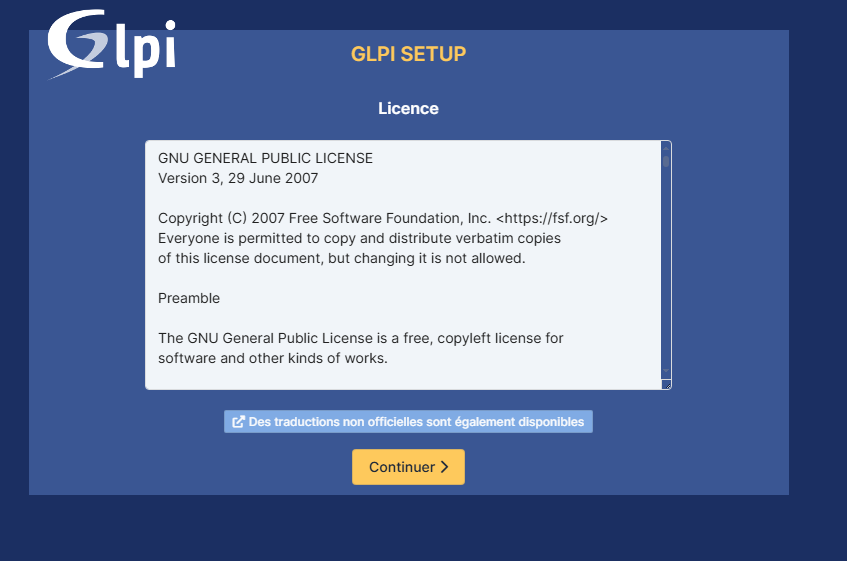

- Ici nous allons sélectionner Installer :

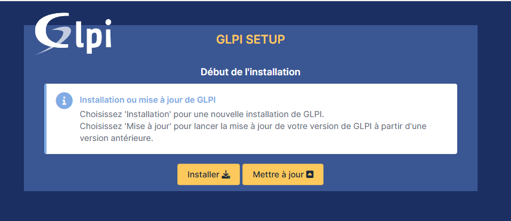

Une liste de tests va s’afficher. Si vous avez bien tous les prérequis, cliquez sur Continuer.

- Configurez la connexion à la base de données :

```
Serveur SQL : localhost
Utilisateur : glpibdd
Mot de passe : <MOT_DE_PASSE>
```

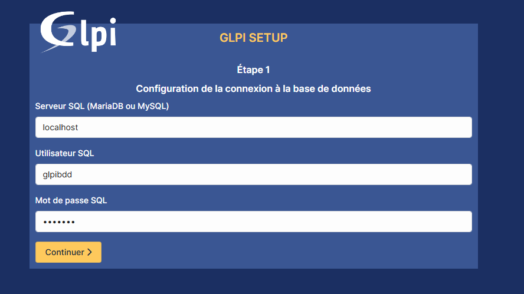

- Sélectionnez ensuite la BDD **glpi** puis **Continuer** :

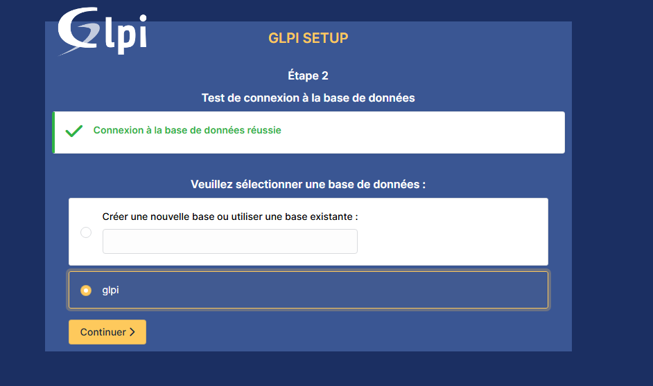


- Finalisez l’installation et notez les identifiants par défaut afin de pouvoir vous connecter a l’interface.
- A la fin de l’installation on va cliquer sur Utiliser GLPI

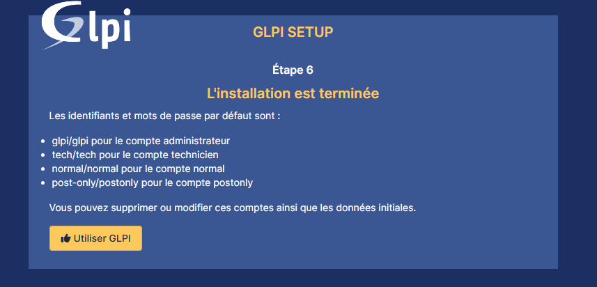

### 13.2 Première connexion

Pour vous identifier la première fois, l’identifiant par défaut est **glpi** avec le mot de passe **glpi******:

- On va tout de suite créer un nouvel utilisateur super-admin au sein de GLPI. Pour cela, allez dans le menu **Administration****/****Utilisateurs** :

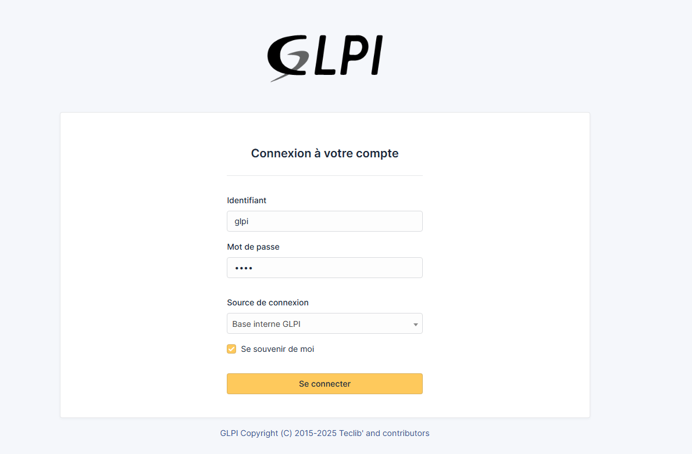

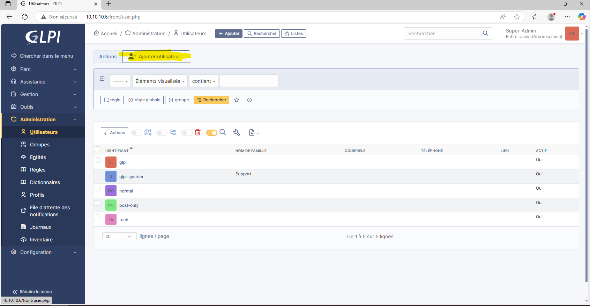

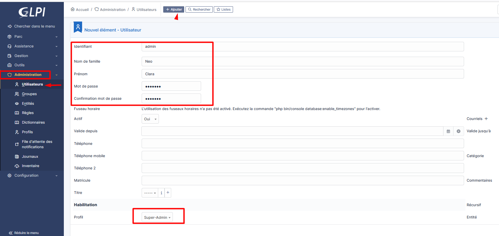

- Maintenant que l’utilisateur est créé on va se connecter avec :

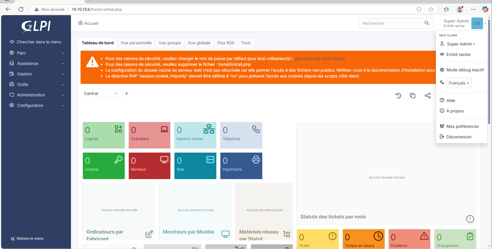

## 14. Inventaire Automatique avec GLPI Agent

GLPI Agent est un outil léger à déployer sur chaque poste (Windows, Linux, macOS) pour remonter automatiquement les informations matérielles et logicielles vers le serveur GLPI.

### 14.1 Activation de l’inventaire automatique dans GLPI

Par défaut, l’inventaire automatique est désactivé dans GLPI 10. Pour l’activer :

- Connectez-vous à l’interface web GLPI en tant qu’administrateur.
- Allez dans Administration > Inventaire.
- Cochez Activer l’inventaire automatique et enregistrez.

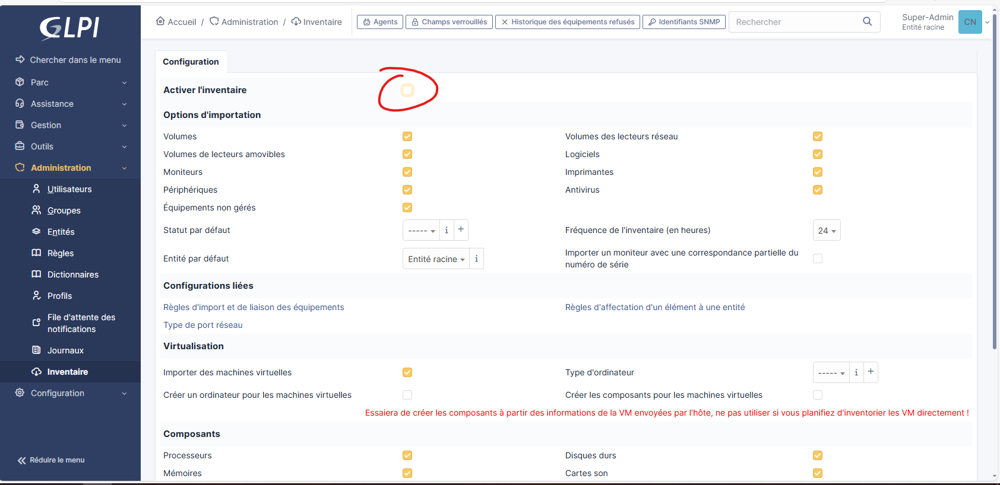

### 14.2 Installation de l’agent sur Windows

Téléchargez la dernière version de GLPI Agent depuis GitHub :https://github.com/glpi-project/glpi-agent/releases

Double-cliquez sur l’installeur .msi et suivez l’assistant.

- L’installation est simple il y’aura un moment ou il faudra renseigner l’adresse IP de votre serveur comme ci-dessous :

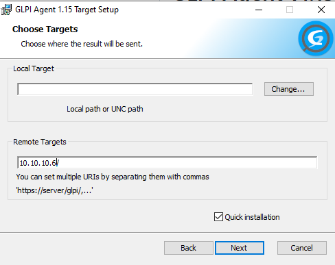

- Pour forcer la remontée immédiate, ouvrez un navigateur sur :

```
http://localhost:62354
Répétez si nécessaire.
```

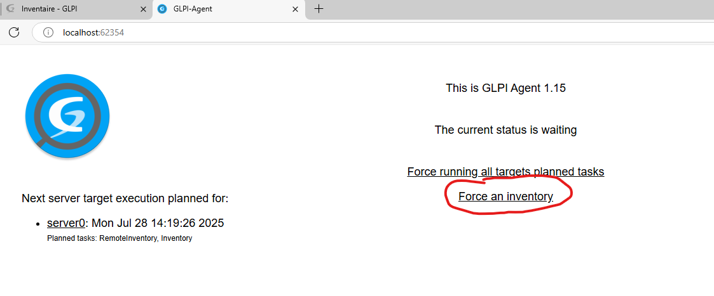

- Vérifiez dans GLPI : **Parc > Ordinateurs** pour voir le poste Windows.

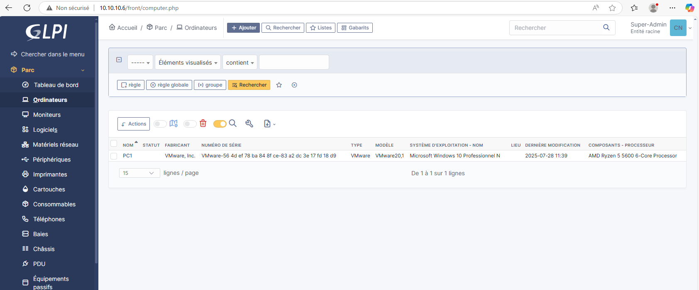

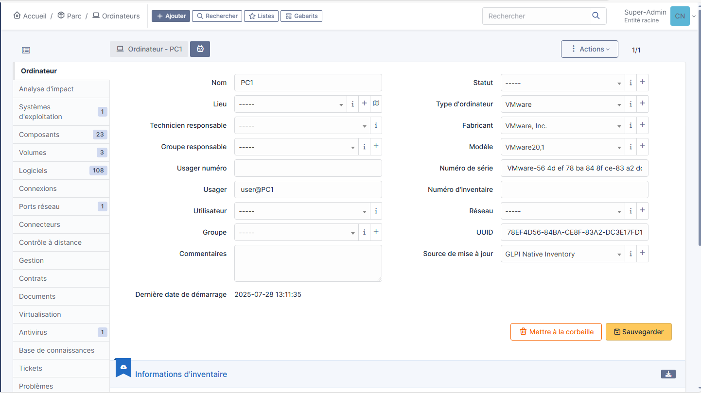

### 14.3. Installation de l’agent sur Linux

- Sur le client Linux voulu installez les dépendances :
*# Télécharger l’installateur (ex. v1.15)*

*wget**https://github.com/glpi-project/glpi-agent/releases/download/1.15/glpi-agent-1.15-linux-installer.pl*

*# Rendre exécutable*

*chmod**+x glpi-agent-1.15-linux-installer.pl*

*# Lancer l’installation*

*./glpi-agent-1.15-linux-installer.pl*

- **Lors de l’exécution**, l’installateur vous demande :

```
Provide an url to configure GLPI server:
http://10.10.10.6 ( votre adresse ip de votre serveur GLPI )
```

- Démarrez et activez le service :

```bash
systemctl enable --now glpi-agent
```

- Forcer l’inventaire :

```
glpi-agent –force
```

- **Vérifier******dans GLPI**:****Parc > Ordinateurs******pour voir le poste Linux.

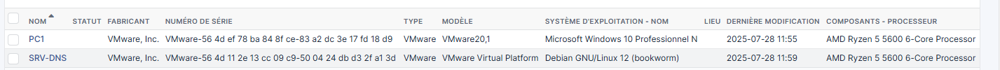

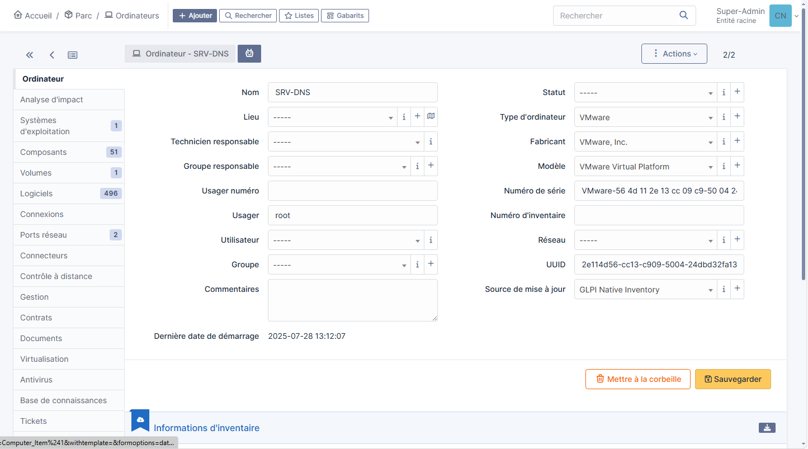

## 15 Intégration d'un annuaire Active Directory dans GLPI via LDAP

### 15.1 Objectif

Configurer GLPI pour qu'il se connecte à un Active Directory (AD) via LDAP afin d'importer automatiquement les utilisateurs du domaine.

### 15.2 Création de l'annuaire LDAP dans GLPI

Aller dans : Configuration > Authentification > LDAP

- Cliquez sur : "Ajouter un annuaire LDAP"

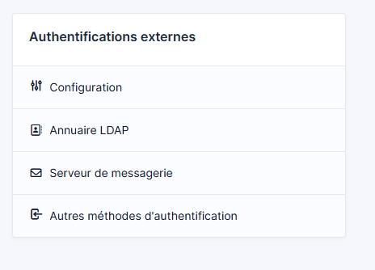

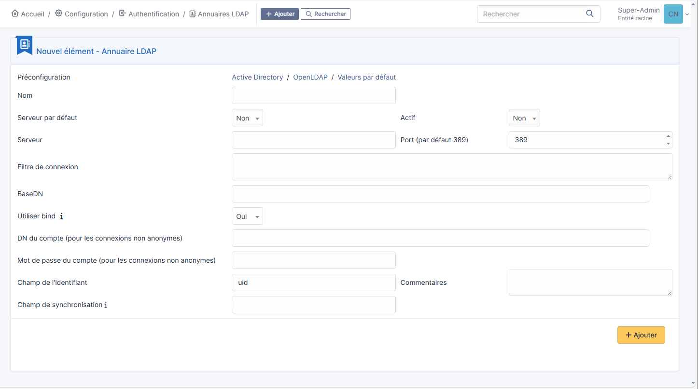

- Voici la configuration pour ajouter notre annuaire LDAP :

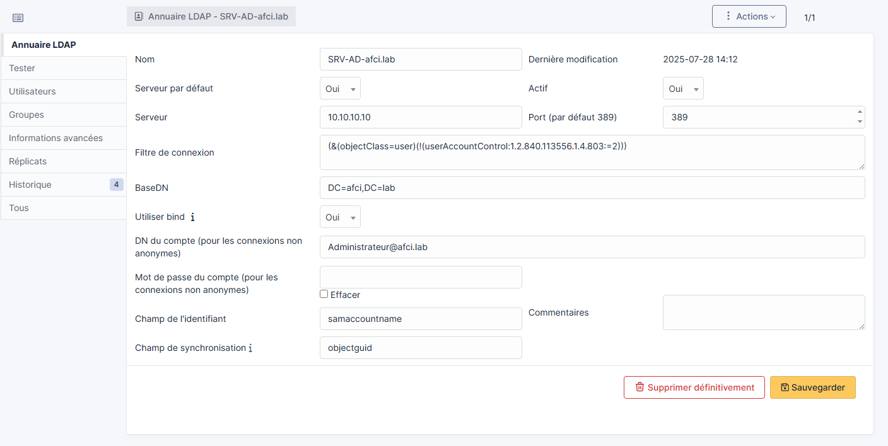

### 15.3 Importer les utilisateurs depuis l’Active Directory

- Cliquez sur le menu :*Administration > Utilisateurs*

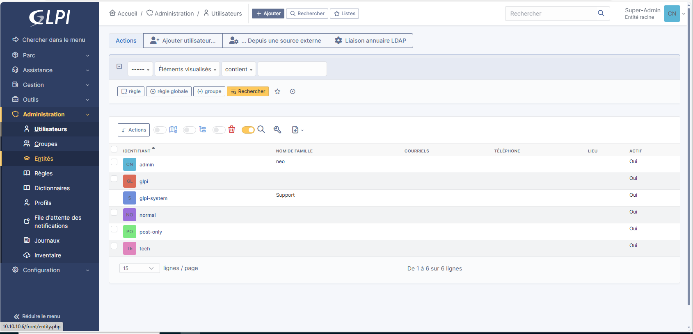

- Cliquez sur :Liaison annuaire LDAP (en haut de la page)

Cliquer sur « Importation de nouveaux utilisateurs »

Puis cliquer sur « Rechercher » (laisser les champs vides)

Les utilisateurs de l'AD doivent apparaître

- Cocher ceux à importer puis cliquer sur « Ajouter »

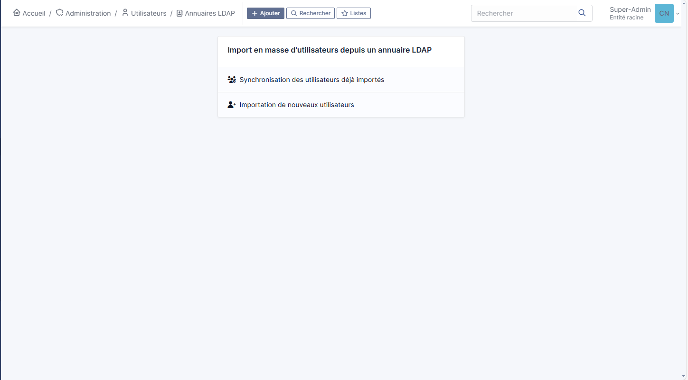

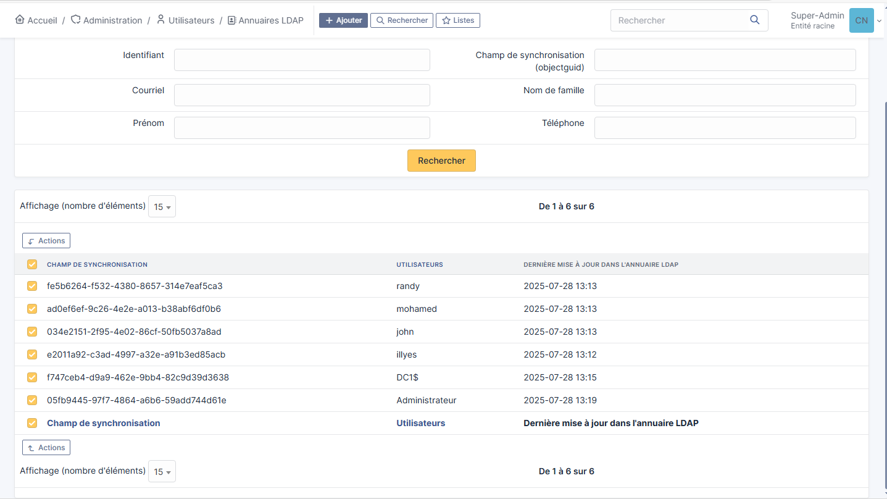

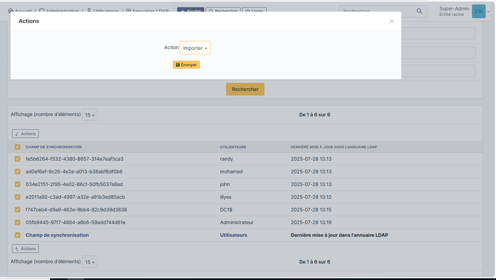

- En retournant sur les utilisateurs on peut voir qu’ils ont bien était importés :

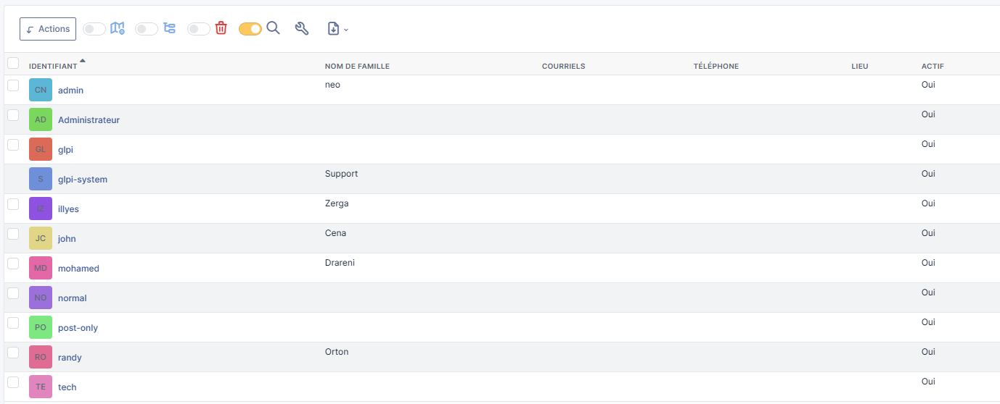

## 16. Activer la synchronisation automatique LDAP

GLPI peut synchroniser automatiquement les utilisateurs à intervalles réguliers via une tâche planifiée.

GLPI ne propose pas toujours une tâche automatique dans l'interface. Pour assurer la synchronisation régulière des utilisateurs LDAP, on va utiliser directement les commandes CLI.

Adapter le chemin selon ton installation GLPI.

- Commande pour synchroniser manuellement :

```
php /var/www/html/bin/console glpi:ldap:synchronize_users
```

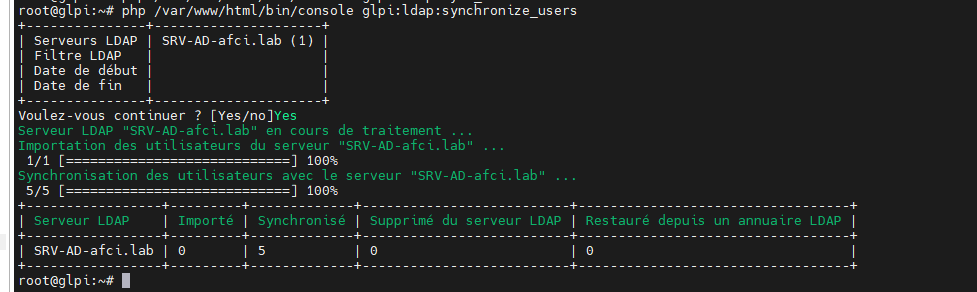

- Pour automatiser : ajouter une tâche cron :

```
crontab -e
```

- Puis avec Nano(1) ajouter :

```
*/5 * * * * /usr/bin/php /var/www/html/bin/console glpi:ldap:synchronize_users &> /dev/null
```

- Cela lancera la synchronisation complète toutes les 5 minutes.

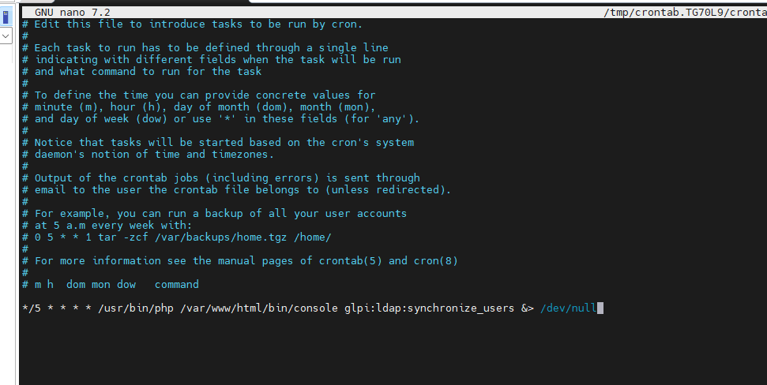

Chaque ajout/suppression/modification dans l'Active Directory est répercuté dans GLPI toutes les 5 minutes

Les nouveaux utilisateurs sont automatiquement importés et mis à jour

Les utilisateurs supprimés dans l'AD sont désactivés dans GLPI (selon config)

- Apres l’ajout d’un utilisateur Ribéry, le changement de nom de John en Jacques et l’ajout d’une adresse mail a illyes dans l’AD au bout de 5 minutes le changement est répercuté sur le GLPI.

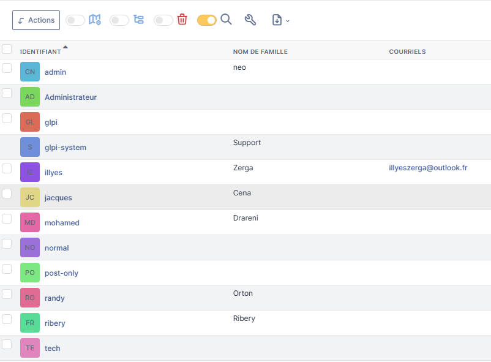

## 17. Déploiement de l’agent GLPI via GPO sur ton `<SERVEUR>`

### 17.1 Préparer le fichier MSI

Télécharge l’agent GLPI depuis :https://github.com/glpi-project/glpi-agent/releases

Copie le fichier .msi (ex. glpi-agent-1.15-x64.msi) dans un dossier partagé accessible à tous les postes :

Exemple : \\`<SERVEUR>`\partages\glpi-agent\glpi-agent-1.15-x64.msi

- Assure-toi que **« Tout le monde » a un accès en lecture** sur ce partage

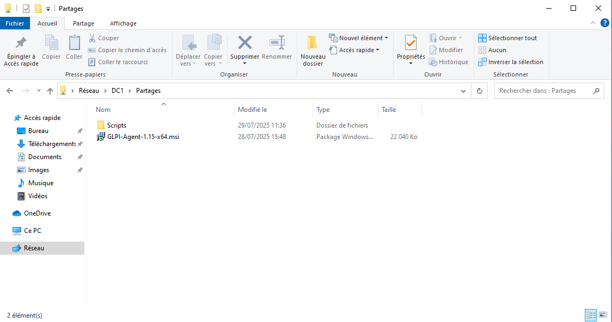

### 17.2 Créer un script de déploiement silencieux

- Crée un fichier .cmd contenant cette ligne :

*msiexec**/i "\\DC1\partages\GLPI-Agent-1.15-x64.msi" /quiet ADDLOCAL=ALL SERVER=http://10.10.10.6/*

Place ce script dans un dossier accessible (ex. : \\DC1\partages\scripts)

### 17.3 Créer une GPO de démarrage

Ouvre **« Gestion des stratégies de groupe »** sur ton `<SERVEUR>`(gpmc.msc)

Cliquez droit sur l’unité d’organisation (OU) ciblée → **Créer une GPO**

Nom : Déploiement Agent GLPI

Éditez la GPO :

Va dans :Configuration de l’ordinateur > Paramètres Windows > Scripts (démarrage/arrêt) > Démarrage

Clique sur **Ajouter**

Cliquez sur **Parcourir**, puis **colle le script** **.cmd**

Exemple : \\DC1\Partages\install-glpi-agent.cmd

- Validez et applique la GPO à l’OU contenant les machines à inventorier

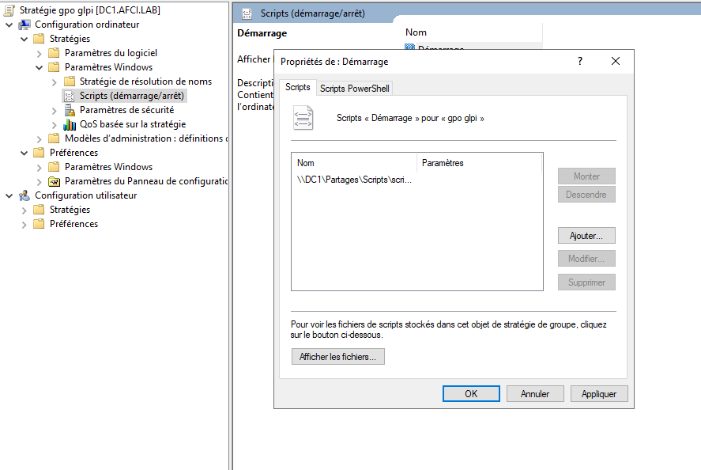

- Sur un poste client du domaine, exécute :

```bash
gpupdate /force
```

Redémarre pour forcer l’application du script de démarrage.

### 17.3 Vérification

- L’agent GLPI doit apparaître dans la liste des services Windows

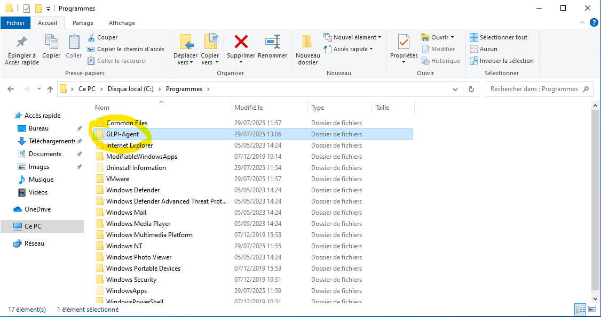

- Le fichier inventory.xml doit être envoyé à ton GLPI (10.10.10.6)

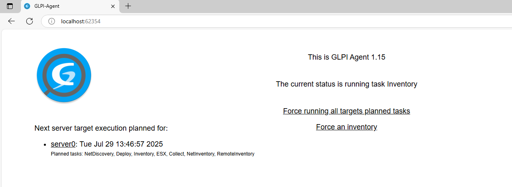

- Dans GLPI :Inventaire > Ordinateurs → voir les nouveaux équipements


## 18. Configuration SMTP dans GLPI

- Dans Configuration/Notifications nous allons cocher les 3 paramètres ci-dessous.

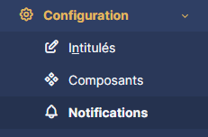

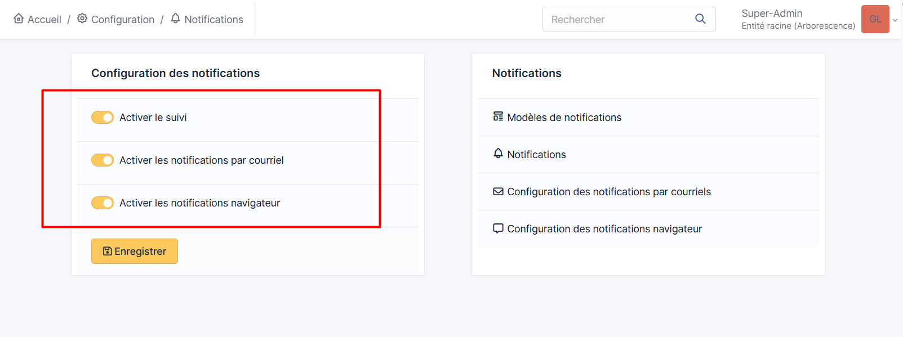

- Ensuite cliquez sur « Configuration des notifications par courriels »

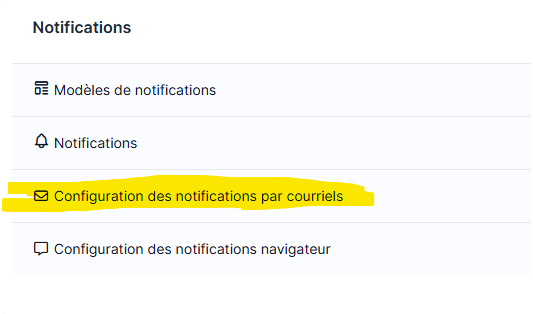

- On va configurer les notifications courriel avec un mail du serveur mail que nous avons configuré plus haut :

- Voici la configuration de notre serveur Mail que l’on peut voir ici sur Rainloop et que on va utiliser pour configurer le GLPI.

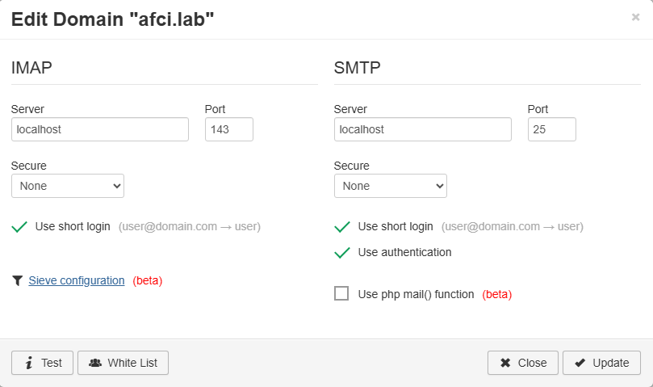

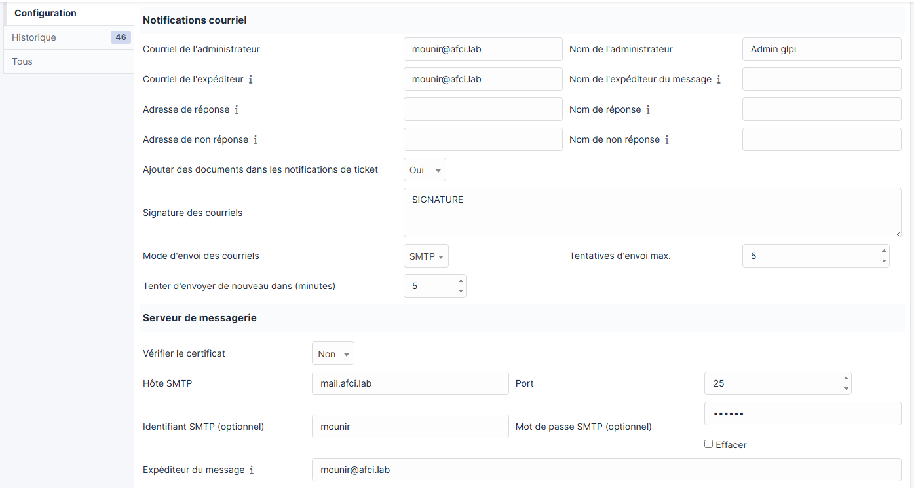

- Nous allons enregistrer puis faire un test de courriel :


- Si on va sur notre adresse mail on peut voir qu’effectivement on a bien reçu le mail de test programmé :

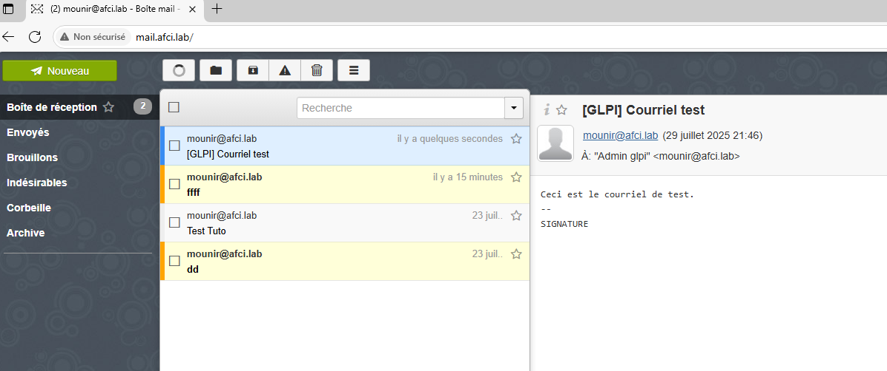
