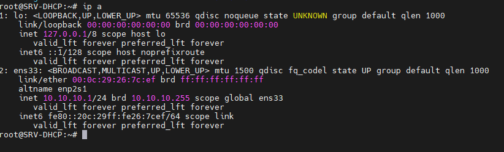
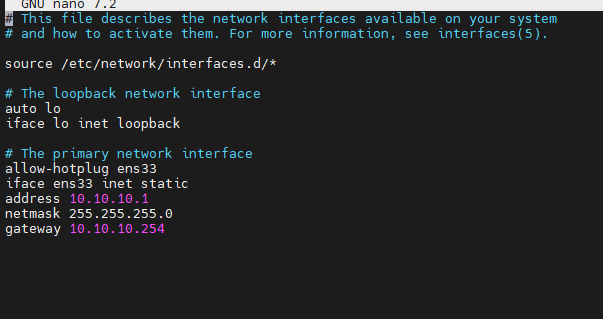
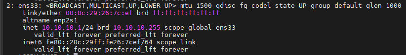
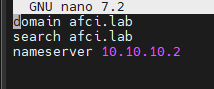
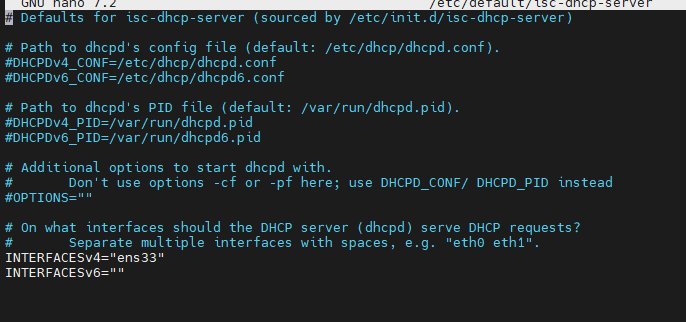
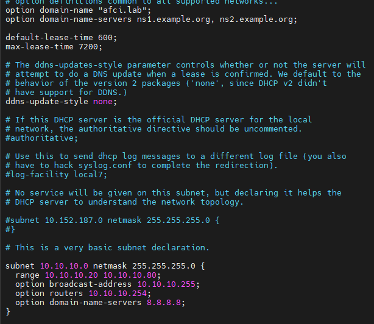
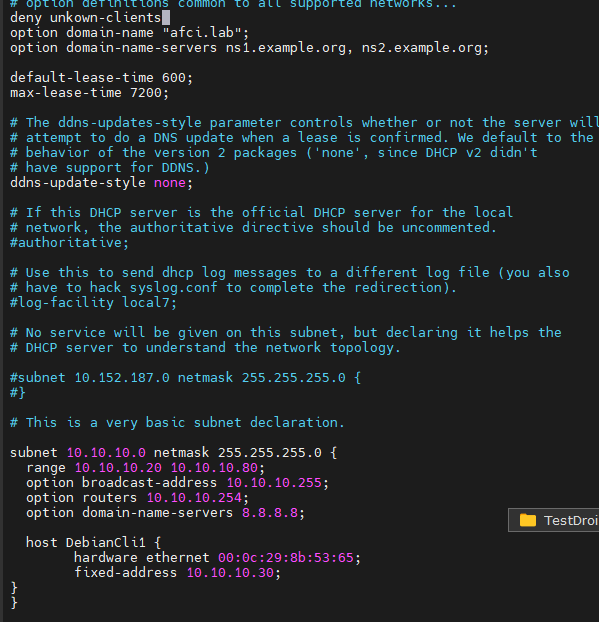
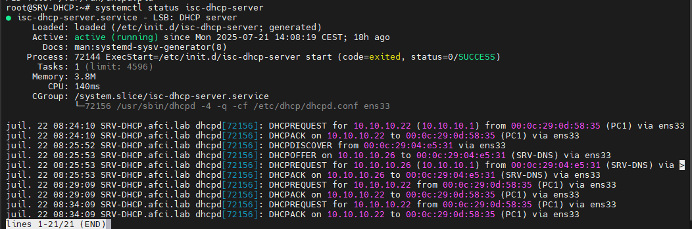
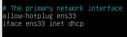
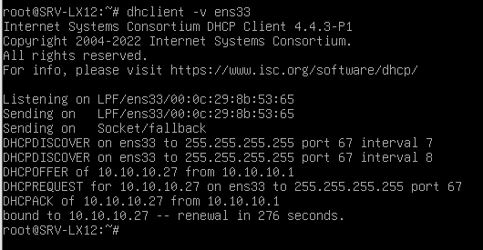

# Réseau : pfSense, DHCP et clients

## Sommaire

- [1. Configuration du Pfsense](#1-configuration-du-pfsense)
  - [1.1 Assigner les interfaces](#11-assigner-les-interfaces)
  - [1.2 Configurer l’IP LAN](#12-configurer-lip-lan)
  - [1.3 Désactiver le serveur DHCP intégré](#13-désactiver-le-serveur-dhcp-intégré)
  - [1.4 Règles de pare-feu DHCP](#14-règles-de-pare-feu-dhcp)
  - [1.5 NAT et routage](#15-nat-et-routage)
- [2. Configuration réseau statique du serveur DHCP](#2-configuration-réseau-statique-du-serveur-dhcp)
- [3. Installation et configuration du serveur DHCP](#3-installation-et-configuration-du-serveur-dhcp)
  - [3.1 Installation](#31-installation)
  - [3.2 Configuration](#32-configuration)
- [4. Démarrage et vérification](#4-démarrage-et-vérification)
- [5. Configuration des clients](#5-configuration-des-clients)
  - [5.1. Installer le client DHCP](#51-installer-le-client-dhcp)
  - [5.2 Configuration persistante](#52-configuration-persistante)
  - [5.3 Liaison ou renouvellement manuel](#53-liaison-ou-renouvellement-manuel)
## 1. Configuration du Pfsense

### 1.1 Assigner les interfaces

- Depuis la console pfSense ou le webConfigurator (option 1 > Assign Interfaces).
- Vérifiez :
- WAN → em0 (DHCP de VMware NAT)
- LAN → em1 (statique 10.10.10.254/24)

### 1.2 Configurer l’IP LAN

- Menu console pfSense : option 2 (Set interface(s) IP address).
- Sélectionnez LAN (em1) :
- IP address: 10.10.10.254
- Subnet bit count: 24
Gateway: none (ou 0.0.0.0)

### 1.3 Désactiver le serveur DHCP intégré

- Dans le webConfigurator : Services > DHCP Server > LAN
- Décochez “Enable DHCP server on LAN interface”.
- Sauvegardez.

### 1.4 Règles de pare-feu DHCP

- Par défaut, pfSense autorise le trafic DHCP LAN. Vérifiez sous Firewall > Rules > LAN que les ports UDP 67/68 sont ouverts.

### 1.5 NAT et routage

- Le WAN en NAT expose pfSense à Internet via l’hôte VMware.
- Le LAN reste isolé, routé vers Internet par pfSense. Pas de NAT supplémentaire requis.

## 2. Configuration réseau statique du serveur DHCP

Avant d’installer le serveur DHCP, il faut que la machine Debian ait une adresse IP fixe dans le sous-réseau.

- Vérifiez le nom de l’interface : *ip**a*

- Éditez-le fichier */**etc**/network/interfaces* pour définir une IP statique :

*auto**ens33*

*iface**ens33**inet****static*

***address**10.10.10.1*

***netmask**255.255.255.0*

***gateway**10.10.10.254 # IP LAN de**pfSense*

- Appliquez la configuration sans redémarrer la VM :
- *ifdown**ens33 &&**ifup**ens33*

- Si besoin, mettez à jour le DNS dans /etc/resolv.conf :

## 3. Installation et configuration du serveur DHCP

### 3.1 Installation

Nous utilisons le paquet ISC DHCP, éprouvé et largement documenté.

*apt**update &&**apt**upgrade*

*apt****install****isc**-**dhcp**-server*

- Après installation, précisez l’interface sur laquelle écouter les requêtes DHCP dans /etc/default/isc-dhcp-server :
- *INTERFACESv4="ens33"*

### 3.2 Configuration

- **3.2.1 Méthode simple (ouvert)**

option domain-name "localdomain";

default-lease-time 600;

max-lease-time 7200;

subnet 10.10.10.0 netmask 255.255.255.0 {

range 10.10.10.20 10.10.10.80;

option broadcast-address 10.10.10.255;

option routers 10.10.10.254;

option domain-name-servers 10.10.10.254;

}

- **3.2.2 Méthode sécurisée (clients connus)**

*deny****unknown**-clients;*

*option****domain-name**"**localdomain**";*

*default**-**lease**-time 600;*

*max**-**lease**-time 7200;*

*subnet**10.10.10.0**netmask**255.255.255.0 {*

***option**broadcast-**address**10.10.10.255;*

***option****routers**10.10.10.254;*

***option****domain**-**name**-servers 10.10.10.254;*

***host**WinCli1 {*

***hardware****ethernet**00:11:22:33:44:55;*

***fixed**-address**10.10.10.20;*

*}*

***host**LinuxCli2 {*

***hardware****ethernet**AA:BB:CC:DD:EE:FF;*

***fixed**-address**10.10.10.21;*

*}*

*}*

## 4. Démarrage et vérification

- Avant de démarrer le service, validez la syntaxe :
*dhcpd**-t -**cf**/**etc**/**dhcp**/**dhcpd.conf*

- Si le test est concluant, redémarrez et activez le service :
*systemctl**restart**isc**-**dhcp**-server*

*systemctl**enable**isc**-**dhcp**-server*

- Vérifiez le statut et analysez les logs pour confirmer le bon fonctionnement :
*systemctl****status****isc**-**dhcp**-server*

*journalctl**-**xeu****isc-dhcp-server.service*

- *grep****dhcpd**/var/log/**syslog**|**tail**-n 20*

## 5. Configuration des clients

- Chaque client doit être configuré pour solliciter une IP via DHCP.

### 5.1. Installer le client DHCP

apt install isc-dhcp-client

### 5.2 Configuration persistante

- Dans */**etc**/network/interfaces*, spécifiez le mode DHCP :

# Exemple pour interface ens33

*auto**ens33*

*iface**ens33**inet****dhcp*

Appliquez les modifications :

*ifdown**ens33 &&**ifup**ens33*

# ou

*systemctl**restart networking*

### 5.3 Liaison ou renouvellement manuel

Pour forcer la demande ou la libération d’un bail :

# Obtenir un nouveau bail

- *dhclient**-v ens33*

# Relâcher le bail

*dhclient**-v -r ens33*

Vous pouvez contrôler les détails du bail dans :

*cat**/var/lib/**dhcp**/**dhclient.leases*
