# Services Linux : DNS, FTP, web, fichiers, messagerie, logs

## Sommaire

- [6. Configuration DNS avec BIND9](#6-configuration-dns-avec-bind9)
  - [6.1 Pré-requis DNS](#61-pré-requis-dns)
  - [6.2 Installation](#62-installation)
  - [6.3 Déclaration des zones](#63-déclaration-des-zones)
  - [6.4 Fichiers des zones](#64-fichiers-des-zones)
  - [6.5 Vérification et démarrage DNS](#65-vérification-et-démarrage-dns)
- [7. Configuration d’un Serveur FTP(S) avec vsftpd](#7-configuration-dun-serveur-ftps-avec-vsftpd)
  - [7.1 Installation de vsftpd](#71-installation-de-vsftpd)
  - [7.2 Configuration initiale](#72-configuration-initiale)
  - [7.3 Activation de FTPS](#73-activation-de-ftps)
  - [7.4 Redémarrage et tests](#74-redémarrage-et-tests)
- [8. Installation et Configuration d’un Serveur Web Apache2](#8-installation-et-configuration-dun-serveur-web-apache2)
  - [8.1. Présentation d’Apache](#81-présentation-dapache)
- [8.2 Installation](#82-installation)
  - [8.3 Configuration de base](#83-configuration-de-base)
  - [8.4 Hôtes virtuels par numéro de port](#84-hôtes-virtuels-par-numéro-de-port)
  - [8.5 Hôtes virtuels par nom DNS (VirtualHosts)](#85-hôtes-virtuels-par-nom-dns-virtualhosts)
- [9. Partage de Fichiers avec Samba](#9-partage-de-fichiers-avec-samba)
  - [9.1 Installation de Samba](#91-installation-de-samba)
  - [9.2 Création des répertoires partagés](#92-création-des-répertoires-partagés)
  - [9.5 Finalisation sur Linux](#95-finalisation-sur-linux)
- [10. Serveur de Messagerie Postfix & Dovecot](#10-serveur-de-messagerie-postfix--dovecot)
  - [10.1 Pré-requis](#101-pré-requis)
  - [10.2. Installation des paquets](#102-installation-des-paquets)
  - [10.3. Configuration de Postfix](#103-configuration-de-postfix)
  - [10.4 Vérification SMTP](#104-vérification-smtp)
  - [10.5. Configuration de Dovecot (IMAP)](#105-configuration-de-dovecot-imap)
  - [10.6 Installation de RainLoop (Webmail)](#106-installation-de-rainloop-webmail)
- [11. Serveur de centralisation de logs (Rsyslog + MySQL + LogAnalyzer)](#11-serveur-de-centralisation-de-logs-rsyslog--mysql--loganalyzer)
  - [11.1 Topologie et rôle](#111-topologie-et-rôle)
  - [11.2 Installation du LAMP et de MySQL](#112-installation-du-lamp-et-de-mysql)
  - [11.4. Installation de LogAnalyzer. Installation de LogAnalyzer](#114-installation-de-loganalyzer-installation-de-loganalyzer)
## 6. Configuration DNS avec BIND9

Pour une infrastructure complète, un DNS interne <domaine> résout noms et IP.

### 6.1 Pré-requis DNS

VM Debian dédiée ou conjointe, IP statique (ex. 10.10.10.2).

Paquet bind9 + dnsutils.

### 6.2 Installation

apt update && apt install bind9 dnsutils

### 6.3 Déclaration des zones

- Éditez /etc/bind/named.conf :

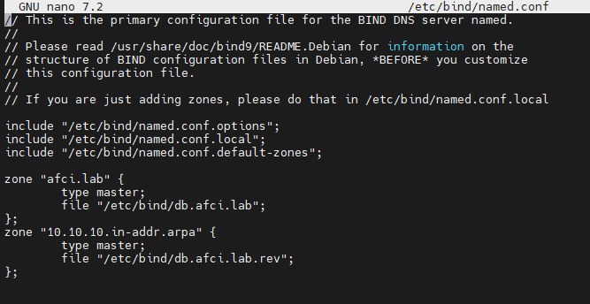

### 6.4 Fichiers des zones

- Zone directe <domaine>

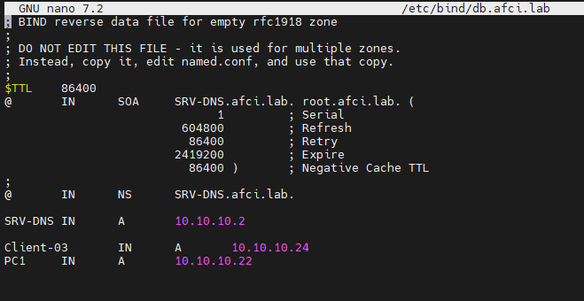

- Zone inversé

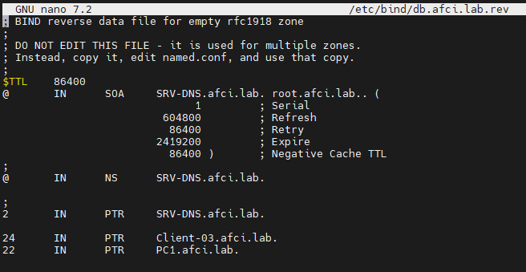

### 6.5 Vérification et démarrage DNS

- Redémarrage et logs :

*systemctl**restart bind9*

*systemctl**enable bind9*

- *systemctl****status**bind9*

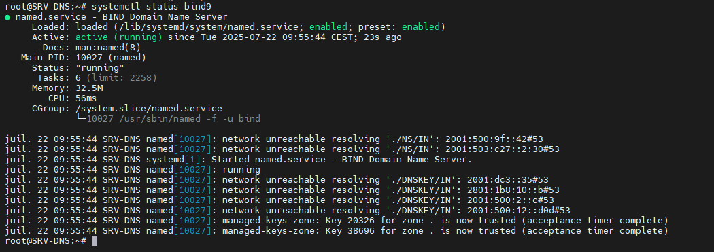

- Test avec la commande dig sur Ebay.fr :

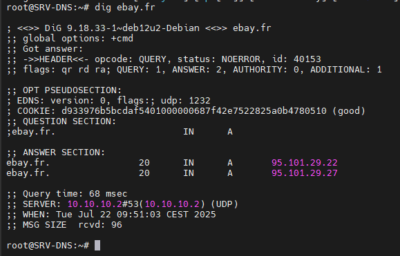

- Test avec la commande dig sur un PC Client du réseau local :

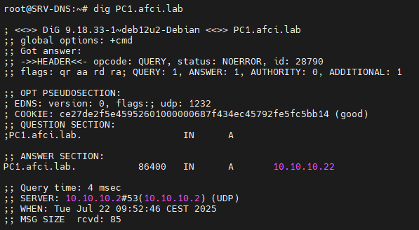

## 7. Configuration d’un Serveur FTP(S) avec vsftpd

Pour permettre le transfert de fichiers sécurisé, nous installerons **vsftpd** (Very Secure FTP Daemon) et activerons FTPS.

### 7.1 Installation de vsftpd

- Installez le paquet et mettez à jour le système :

*apt**update &&**apt**–y upgrade*

*apt**-y**install****vsftpd*

### 7.2 Configuration initiale

- Ouvrez /etc/vsftpd.conf et appliquez les changements suivants (le fichier est assez conséquent) :

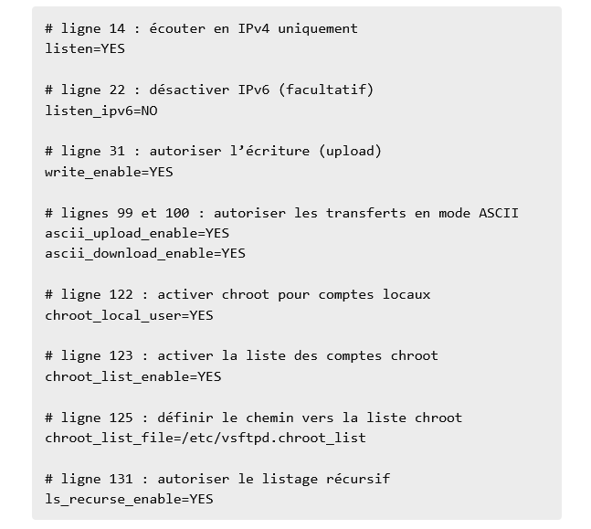

- Créez deux utilisateurs Linux (exemple ici avec user1) :

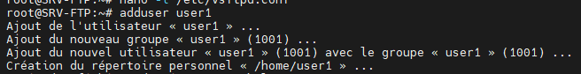

- Leurs répertoires personnels seront utilisés comme racines FTP. Ajustez les permissions si nécessaire :

*find**/home/user1 -type d -**exec**chmod 750 {} \;*

*find**/home/user1 -type f -**exec**chmod 640 {} \;*

- Ajoutez la liste des utilisateurs autorisés dans */**etc**/**vsftpd.chroot_list* :

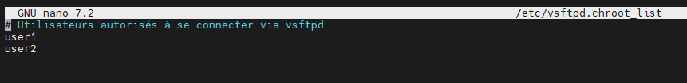

### 7.3 Activation de FTPS

- Pour chiffrer les échanges FTP et renforcer la sécurité, suivez ces étapes:

Rendons-nous dans le répertoire dédié aux clés SSL

Nous allons y générer le fichier vsftpd.pem, contenant à la fois le certificat voulu et une clé RSA de 2048 bits, valable 365 jours :

*openssl****req**-x509 -**nodes**-**newkey**rsa:2048 -**keyout****vsftpd.pem**-out**vsftpd.pem**-**days**365*

- Le système nous demandera de saisir des informations pour compléter le certificat. Exemple :

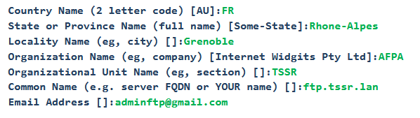

- Restreignons les permissions sur le fichier nouvellement créé au seul utilisateur propriétaire :

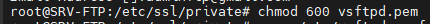

Il faut maintenant modifier le fichier de configuration de vsftpd afin qu’il tienne compte du certificat :

*nano**/**etc**/**vsftpd.conf*

- Nous y ajouterons les lignes suivantes :

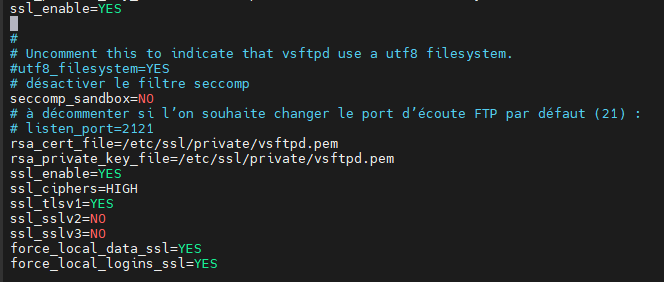

Reste à redémarrer le service :

*systemctl**restart**vsftpd*

### 7.4 Redémarrage et tests

- Avec FileZilla, contrairement à l’étape sans SSL/TLS, nous opterons pour une « Connexion FTP explicite sur TLS » :

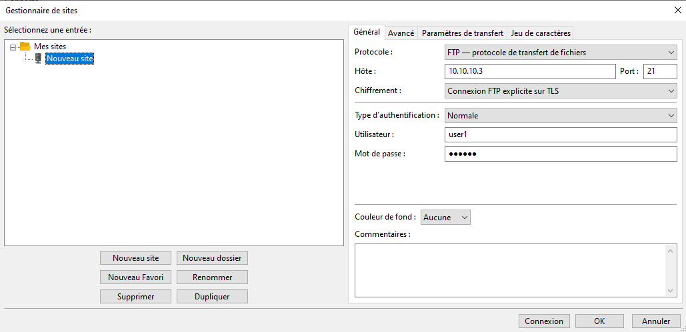

- Initialement inconnu de notre PC, le certificat est affiché. À nous de l’approuver s’il donne des données cohérentes avec notre infrastructure :

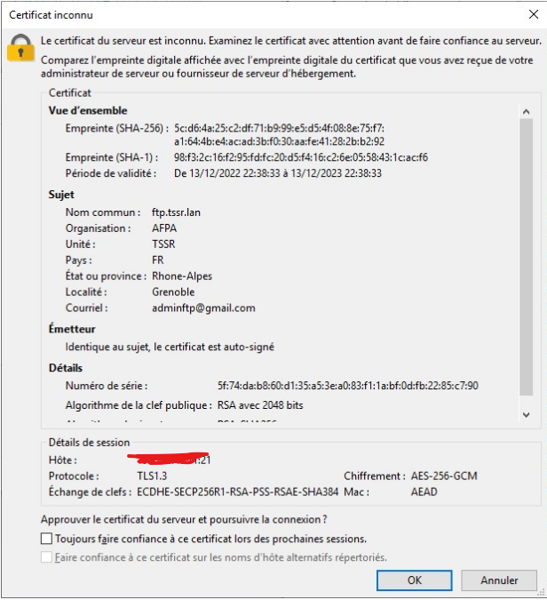

- On arrive donc à nous connecter en FTPS :

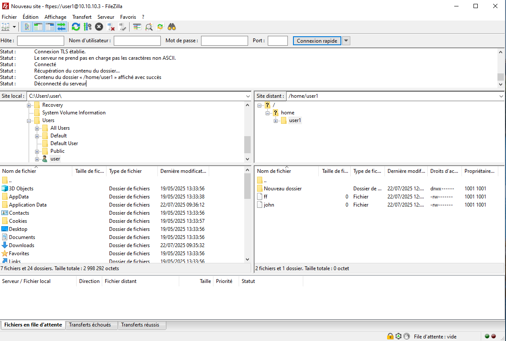

## 8. Installation et Configuration d’un Serveur Web Apache2

Pour héberger des sites web internes ou prototypes, Apache2 constitue une solution robuste et modulable.

### 8.1. Présentation d’Apache

Apache est le serveur HTTP le plus utilisé au monde, compatible Linux et multiplateforme.

Version ciblée : Debian 10/11/12 (Apache 2.4.x).

Avantages : modularité, communauté active, large documentation.

## 8.2 Installation

- Mettez à jour vos dépôts puis installez le paquet :
*apt**update &&**apt****install**apache2 -y*

- Vérifiez la version :
*apache**2 -v*

- Assurez-vous que le service est actif :
- *systemctl****status**apache2*

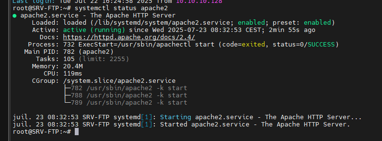

### 8.3 Configuration de base

- Définir ServerName pour éviter les erreurs au démarrage :
echo "ServerName <domaine>" >> /etc/apache2/apache2.conf

- Tester la configuration :
apache2 -t

- Redémarrer Apache :
*systemctl**restart apache2*

### 8.4 Hôtes virtuels par numéro de port

La méthode la plus utilisée consiste à faire correspondre un nom de domaine virtuel à un répertoire.

- Créer les répertoires :
*mkdir**-p /var/www/**vhosts**/site1 /var/www/**vhosts**/site2*

- Créer une page d’accueil pour le site 1 avec la commande :
*nano**/var/www/**vhosts**/site1/index.html*

- Ajouter ces lignes dans le fichier « /var/www/vhosts/site1/index.html » :

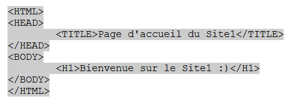

- Faire la même chose pour la page 2.

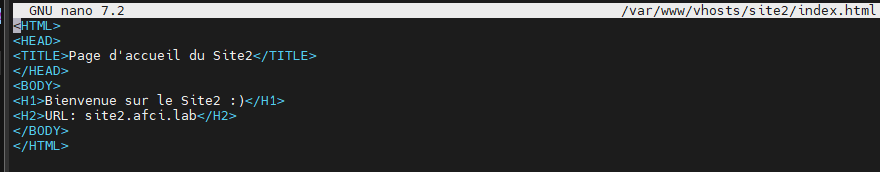

- Créer un fichier de configuration «/etc/apache2/sites-available/port_vhosts.conf » avec la commande :
*nano**/**etc**/apache2/sites-**available**/**port_vhosts.conf*

- Ajouter ces lignes dans le fichier « /etc/apache2/sites-available/port_vhosts.conf »

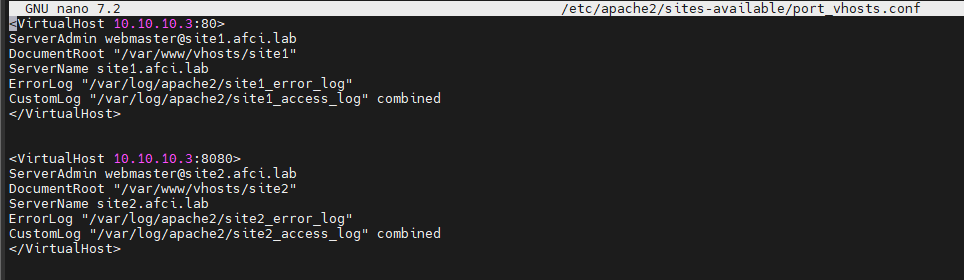

Le site 1 est configuré pour répondre sur le port 80 et le site 2 est configuré pour répondre sur le port 8080.

Configurer Apache pour qu’il écoute sur le port 8080, en plus du port 80.

Il faut, pour cela, éditer le fichier « /etc/apache2/ports.conf » avec la commande :

*nano**/**etc**/apache2/**ports.conf*

- Ajouter la ligne « Listen 8080 » dans le fichier « /etc/apache2/ports.conf » :

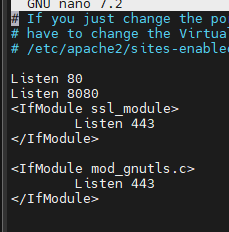

Activer la configuration des hôtes virtuels avec la commande :

*a**2ensite**port_vhosts*

Redémarrer le service apache2 :

*systemctl****reload**apache2*

- Visualiser la configuration via le navigateur web et constater la présence de 2 sites sur la même adresse IP mais différenciés par le numéro de port

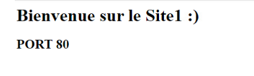

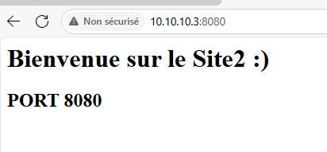

### 8.5 Hôtes virtuels par nom DNS (VirtualHosts)

Pour cette configuration, une seule adresse IP est utilisée.

Il s’agit de la méthode recommandée et aussi la plus utilisée puisqu’il est plus facile de retenir un nom qu’une adresse IP.

Plusieurs noms DNS sont associés à une seule adresse IP et correspondent à plusieurs sites web.

- Sur le serveur DNS nous allons ajouter à la zone de recherche direct le serveur DNS et les 2 sites (on va utiliser le CNAME).
- L’URL site1.<domaine> sera utilisée pour le site 1.
- L’URL site2.<domaine> sera utilisée pour le site 2.

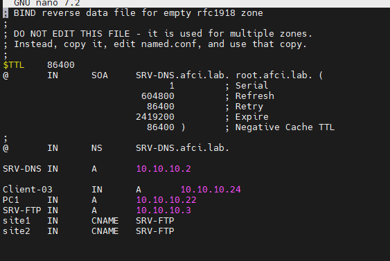

- Désactiver la configuration précédente avec la commande :
*a**2dissite**port_vhosts*

- Redémarrer le service apache2 :
*systemctl****reload**apache2*

- Créer un fichier de configuration avec la commande :
*nano**/**etc**/apache2/sites-**available**/**name_vhosts.conf*

- Ajouter ces lignes dans le fichier « /etc/apache2/sites-available/name_vhosts.conf » :

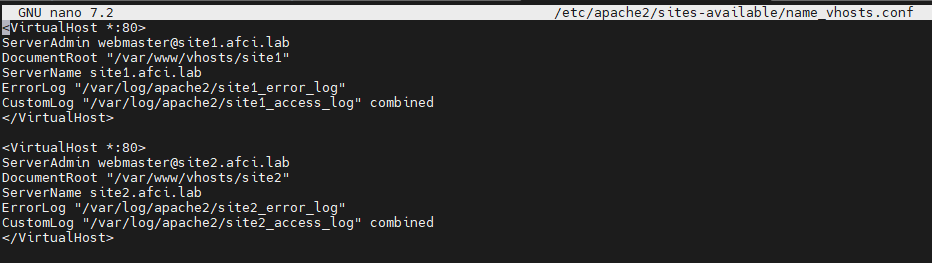

- Dans le fichier « /var/www/vhosts/site1/index.html », ajouter la ligne :

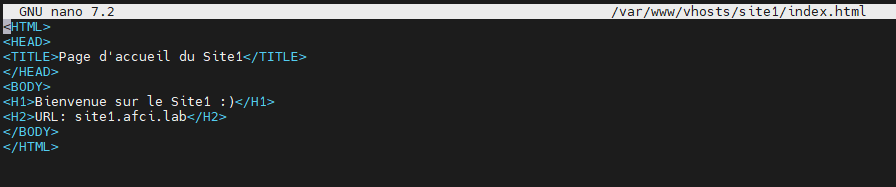

- Faites de même pour le site2 :

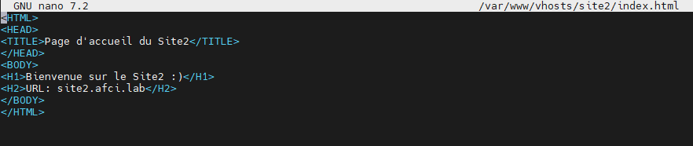

Activer la configuration des hôtes virtuels avec la commande :

*a**2ensite**name_vhosts*

Redémarrer le service apache2 :

*systemctl****reload**apache2*

- Visualiser la configuration via le navigateur web :

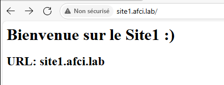

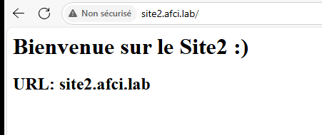

## 9. Partage de Fichiers avec Samba

### 9.1 Installation de Samba

-Installez Samba et les utilitaires :

```bash
apt install samba samba-common-bin -y
```

- Répondez non aux questions DHCP et WINS si elles apparaissent.

### 9.2 Création des répertoires partagés

Créez un répertoire principal et deux sousdossiers pour élèves et enseignants :

```bash
mkdir -p /home/NAS/Partage_eleves
mkdir -p /home/NAS/Partage_enseignants
```

Appliquez les permissions de base (lecture/écriture pour le groupe) :

```bash
chmod 770 /home/NAS/Partage_eleves
chmod 770 /home/NAS/Partage_enseignants
```

- Création des utilisateurs et groupes
- Créez deux groupes Unix :

```
groupadd eleves
groupadd enseignants
```

- Ajoutez des utilisateurs dans chaque groupe :

```
useradd -m -g eleves eleve1
useradd -m -g eleves eleve2
useradd -m -g enseignants prof1
useradd -m -g enseignants prof2
```

- Assignez un mot de passe Samba à chacun :

```
smbpasswd -a eleve1
smbpasswd -a eleve2
smbpasswd -a prof1
smbpasswd -a prof2
```

- Configuration de Samba
- Sauvegardez la configuration par défaut :

```bash
cp /etc/samba/smb.conf /etc/samba/smb.conf.save
```

- Ouvrez /etc/samba/smb.conf
- Changez ses paramètres comme sur la photo :

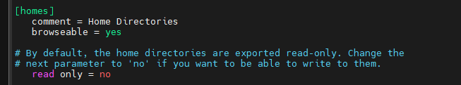

- Et ajoutez sous Share Definitions :

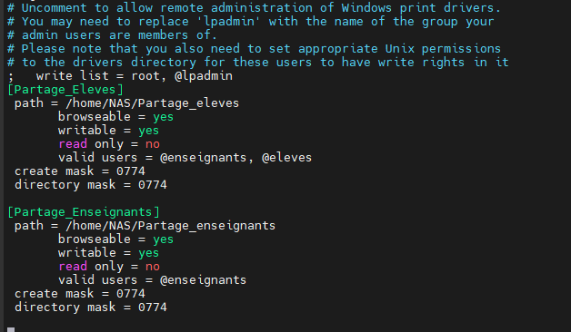

- Appliquez les changements avec :

```bash
systemctl restart smbd.service
```

```
testparm
```

### 9.5 Finalisation sur Linux

Pour que les permissions Unix reflètent celles de Samba, ajustez la propriété et les droits :

```bash
chown -R root:eleves /home/NAS/Partage_eleves
chown -R root:enseignants /home/NAS/Partage_enseignants
chmod -R ug+rwx,o+rx-w /home/NAS
systemctl restart smbd.service
```

- Vérification depuis un client Windows
- Notez l’adresse IP du serveur (ip a).
- Dans l’explorateur Windows, saisissez l’UNC :


- Testez l’accès avec eleve1, eleve2, prof1 ou prof2, créez/modifiez des fichiers pour vérifier les droits.

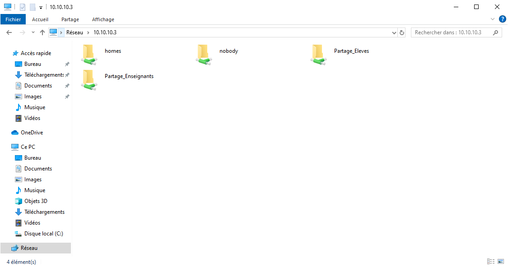

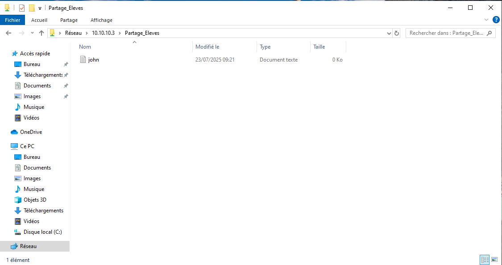

## 10. Serveur de Messagerie Postfix & Dovecot

Pour fournir un service de messagerie interne complet (SMTP, IMAP) et webmail, nous utiliserons Postfix et Dovecot, accompagnés de RainLoop pour l’accès web.

### 10.1 Pré-requis

VM Debian avec IP statique (ex. 10.10.10.4).

Nom de domaine interne (mail.<domaine>) pointant vers cette IP via DNS.

Paquets : postfix, mailutils, dovecot-core, dovecot-imapd, apache2, php, libapache2-mod-php.

### 10.2. Installation des paquets

```bash
apt update && apt upgrade -y
apt install postfix mailutils dovecot-core dovecot-imapd apache2 php libapache2-mod-php -y
```

- Pendant l’installation de Postfix :
Sélectionnez **Internet Site**.

- Entrez le nom de domaine **mail.<domaine>**.

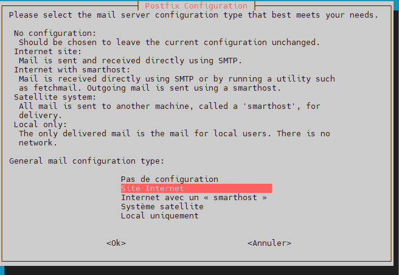

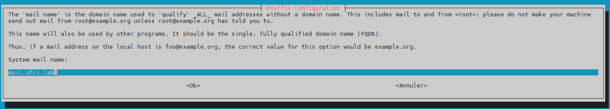

### 10.3. Configuration de Postfix

- Sauvegardez la configuration par défaut :

```bash
cp /etc/postfix/main.cf /etc/postfix/main.cf.backup
```

- Éditez /etc/postfix/main.cf et ajustez comme sur la photo :

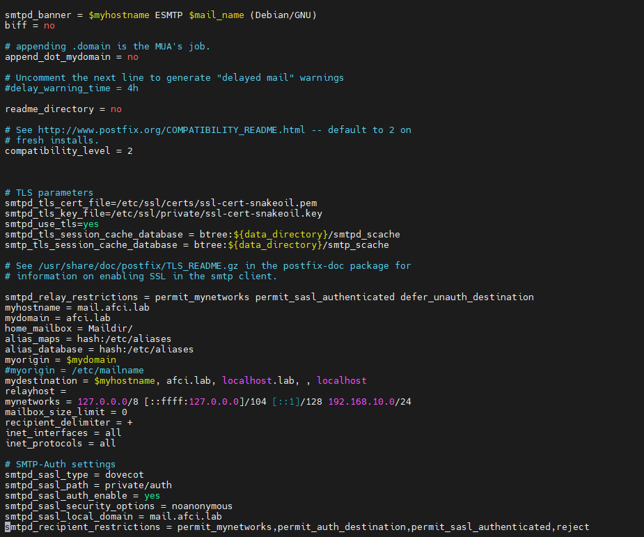

- Redémarrez Postfix :

```bash
systemctl restart postfix
systemctl enable postfix
```

### 10.4 Vérification SMTP

- Testez l’envoi local :

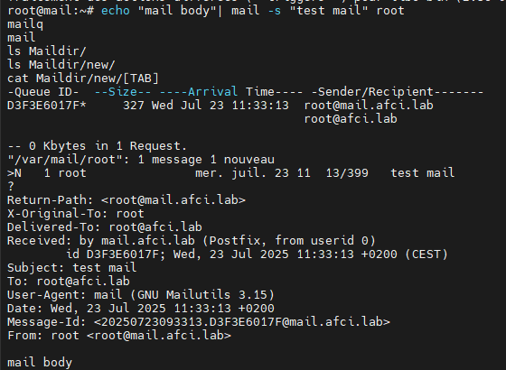

### 10.5. Configuration de Dovecot (IMAP)

- Activez l’écoute : dans /etc/dovecot/dovecot.conf, décommentez :

```
listen = *
```

- Authentification : dans /etc/dovecot/conf.d/10-auth.conf :

```
disable_plaintext_auth = no
auth_mechanisms = plain login
```

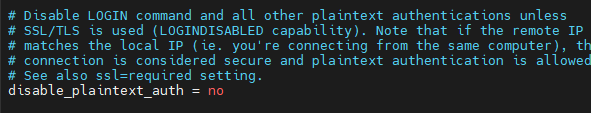

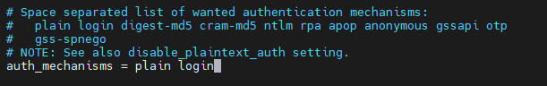

Emplacement des emails : dans /etc/dovecot/conf.d/10-mail.conf :

```
mail_location = maildir:~/Maildir
```

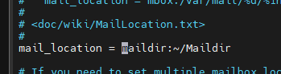

- Permissions du service : dans /etc/dovecot/conf.d/10-master.conf :

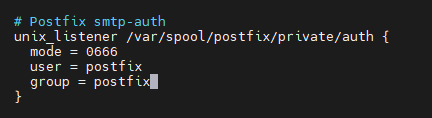

Redémarrez Dovecot :

```bash
systemctl restart dovecot
systemctl enable dovecot
```

### 10.6 Installation de RainLoop (Webmail)

Avant l’installation de RainLoop, assurez-vous d’avoir installé les dépendances nécessaires :

```bash
apt update && apt install apache2 php libapache2-mod-php php-curl php-xml php-mbstring -y
```

- Puis procédez à l’installation de RainLoop :

```bash
cd /var/www/html
rm index.html
curl -sL https://repository.rainloop.net/installer.php | php
```

- Accédez ensuite à : http://mail.<domaine>/?admin

```
**User** : admin / **Password** : <MOT_DE_PASSE>
```

- Ajoutez le domaine <domaine> avec serveur IMAP/SMTP 127.0.0.1.

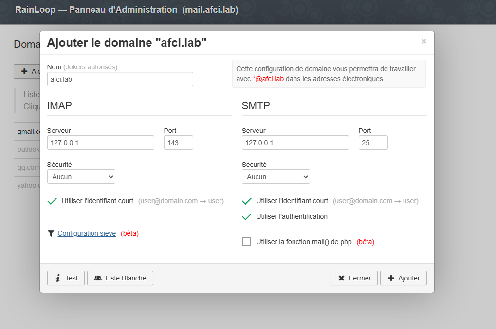

- Ensuite on se connecte à l’utilisateur que l’on a créé précédemment la Mounir par exemple.

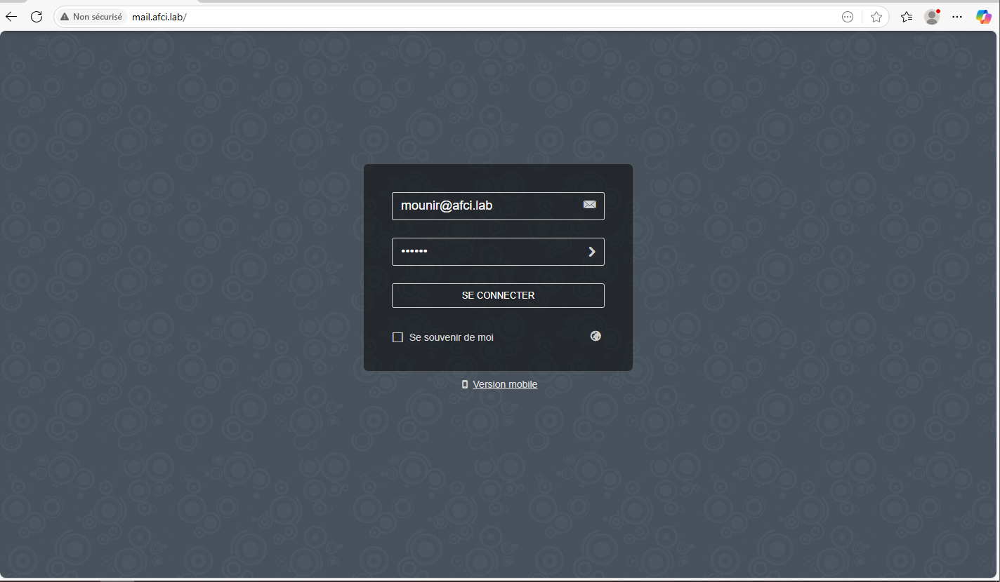

- Ensuite une fois connecté nous allons envoyer un mail afin de tester le bon fonctionnement du serveur mail :

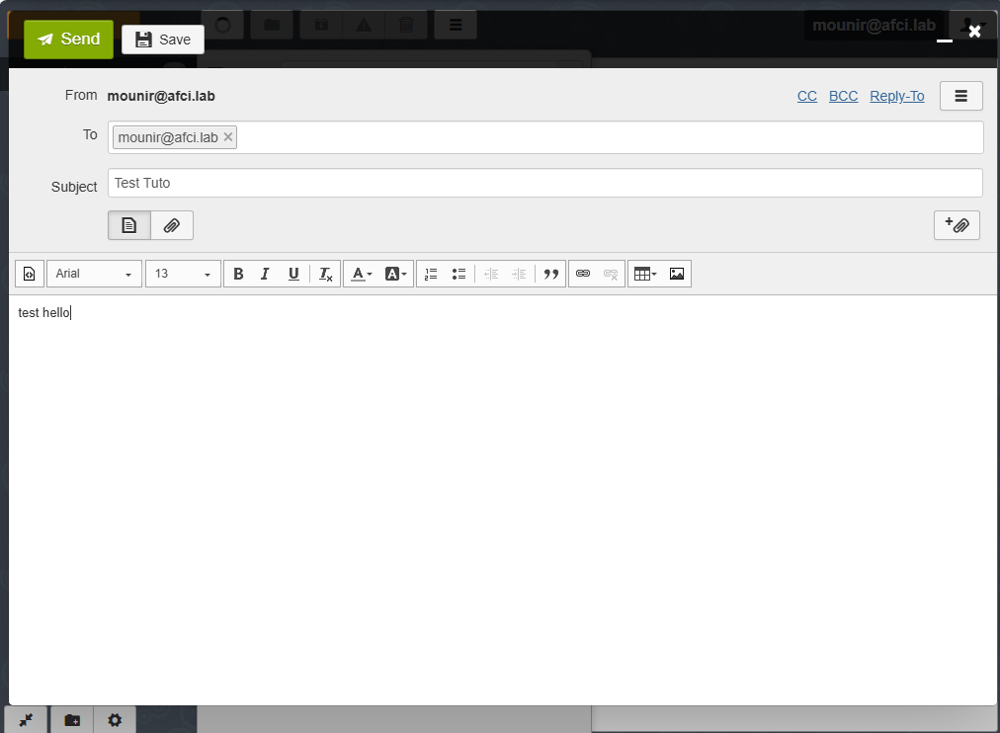

- Suite à l’envoi du mail nous pouvons voir que nous l’avons bien reçu

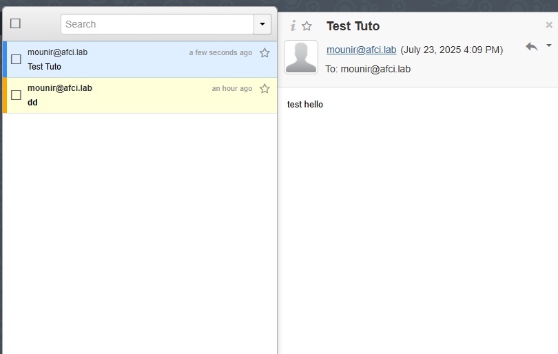

## 11. Serveur de centralisation de logs (Rsyslog + MySQL + LogAnalyzer)

Pour agréger et analyser les journaux de vos machines Linux et Windows, nous mettons en place un serveur de logs centralisé basé sur rsyslog, MySQL/MariaDB et LogAnalyzer.

### 11.1 Topologie et rôle

- **Serveur****syslog** (Debian 12, IP 10.10.10.5) : réception et stockage des logs dans une base.
- **Serveur web** (même machine) : héberge l’interface LogAnalyzer.
- **Clients Linux et Windows** : envoient leurs logs vers le serveur syslog.

### 11.2 Installation du LAMP et de MySQL

- Mettez à jour et installez Apache, PHP, MariaDB :

```bash
apt update && apt upgrade -y
apt install apache2 php libapache2-mod-php php-mysql mariadb-server -y
```

- Sécurisez MariaDB :

```
mysql_secure_installation
```

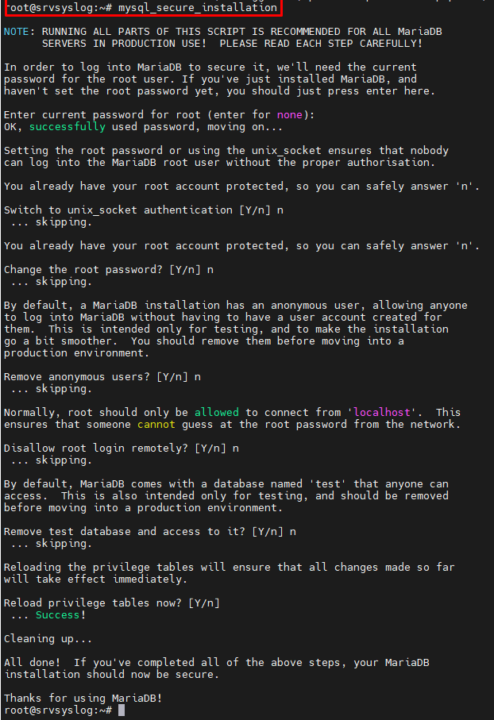

- Créez une base Syslog et un utilisateur rsyslog :

```bash
sudo mysql -u root -p
```

Puis, d’un seul tenant

- Créez une base Syslog et un utilisateur rsyslog :

```bash
apt install rsyslog rsyslog-mysql -y
```

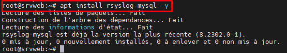

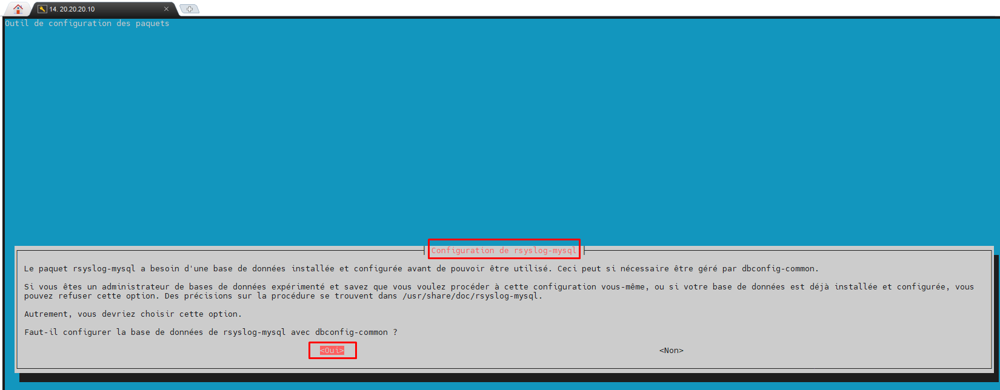

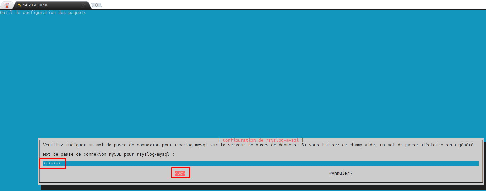

- Modification du fichier rsyslog.conf

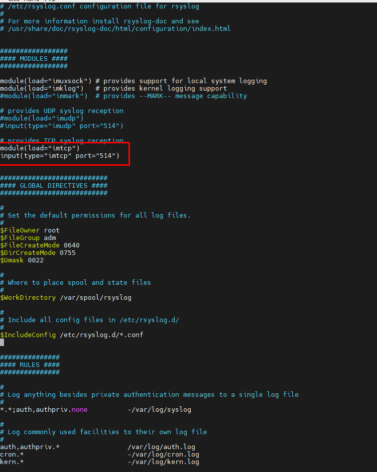

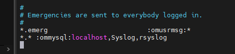

- Redemarrer rsyslog

```bash
systemctl restart rsyslog
```

### 11.4. Installation de LogAnalyzer. Installation de LogAnalyzer

- Téléchargez la version stable :

```bash
cd /src
wget https://download.adiscon.com/loganalyzer/loganalyzer-4.1.13.tar.gz
```

```
tar -zxvf loganalyzer-4.1.13.tar.gz
```

```bash
mkdir -p /var/www/html/loganalyzer
cp -r loganalyzer-4.1.13/* /var/www/html/loganalyzer/
chown -R www-data:www-data /var/www/html/loganalyzer
```

- Dans le navigateur, accédez à

```
http://10.10.10.5/loganalyzer
```


- Suivez l’assistant :


- Vous devriez avoir cela dans la page d’accueil :


Si vous avez une erreur d’affichage verifiez bien les logs apache afin de voir d’où provient le souci :

```bash
sudo tail -f /var/log/apache2/error.log
```

Dans mon cas la colonne processid et checksum n’était pas présente je l’ai donc ajouté à la table manuellement :

*sudo****mysql**-u root -p -e "*

*USE**Syslog;*

*ALTER TABLE**SystemEvents*

*ADD COLUMN checksum**INT(**11) NULL DEFAULT NULL,*

*ADD COLUMN**processid****VARCHAR(**60) NULL DEFAULT NULL;*

- Ensuite sur un des serveur ( le SRV-MAIL par ex ) on va installer Rsyslog et modifier quelques fichiers :
- On va ensuite modifier le fichier suivant :


- Puis modifions ce fichier aussi :


- Ensuite on reboot le service rsyslog :


- Le server web remonte bien ses logs :


- Ensuite on va télécharger et installer rsyslog sur un Windows 10
- Puis, à installer sur le serveur ou le client Windows dont on souhaite remonter les logs :
- Test la connexion :


- Il faut vérifier la réception des logs dans l’interface de LogAnalyzer.


- Et les logs remontent sur Loganalyzer :


