# Supervision : Nagios et NRPE

## Sommaire

- [19. Procédure d'installation de Nagios et Supervision de l'infrastructure](#19-procédure-dinstallation-de-nagios-et-supervision-de-linfrastructure)
  - [19.1 Installation des prérequis pour Nagios : (en une seule ligne)](#191-installation-des-prérequis-pour-nagios-en-une-seule-ligne)
  - [19.2 Téléchargement et Installation de Nagios Core Service](#192-téléchargement-et-installation-de-nagios-core-service)
  - [19.3 Compiler et installer Nagios](#193-compiler-et-installer-nagios)
  - [19.4 Créer un mot de passe pour l'accès web](#194-créer-un-mot-de-passe-pour-laccès-web)
  - [19.5 Configuration du site nagios sur le serveur Apache2 :](#195-configuration-du-site-nagios-sur-le-serveur-apache2-)
  - [19.6 Installer les plugins Nagios](#196-installer-les-plugins-nagios)
  - [19.7 Compiler et installer les plugins](#197-compiler-et-installer-les-plugins)
  - [19.8 Démarrer et activer le service Nagios et accès à l’interface Web](#198-démarrer-et-activer-le-service-nagios-et-accès-à-linterface-web)
- [20. Superviser une machine distante avec NRPE](#20-superviser-une-machine-distante-avec-nrpe)
  - [20.1 Installer les paquets requis et l’installation NRPE](#201-installer-les-paquets-requis-et-linstallation-nrpe)
  - [20.2 Compiler et installer NRPE](#202-compiler-et-installer-nrpe)
  - [20.3 Modifier la configuration NRPE](#203-modifier-la-configuration-nrpe)
  - [20.4 Démarrer et activer le service NRPE](#204-démarrer-et-activer-le-service-nrpe)
  - [20.5 Installer les plugins Nagios sur SRV-Mail](#205-installer-les-plugins-nagios-sur-srv-mail)
  - [20.6 Compiler et installer les plugins](#206-compiler-et-installer-les-plugins)
  - [20.7 Tester la communication depuis SRV-NAGIOS (10.10.10.7)](#207-tester-la-communication-depuis-srv-nagios-1010107)
  - [20.8 Intégrer SRV-Mail à Nagios](#208-intégrer-srv-mail-à-nagios)
  - [20.9 Vérifier la configuration et relancer Nagios](#209-vérifier-la-configuration-et-relancer-nagios)
  - [20.10 Résultat attendu](#2010-résultat-attendu)
## 19. Procédure d'installation de Nagios et Supervision de l'infrastructure

Nagios est un outil open source de supervision permettant de surveiller l’état d’un réseau informatique : machines, services, ressources, etc.

Ce lab vise à installer **Nagios****Core** sur une VM Debian (SRV-NAGIOS) en utilisant une configuration classique. On utilise l’accès Internet via pfSense.

### 19.1 Installation des prérequis pour Nagios : (en une seule ligne)

Nagios a besoin de plusieurs paquets pour compiler son code source et fonctionner avec Apache et PHP :

```bash
apt-get install -y autoconf gcc libc6 make wget unzip apache2 apache2-utils php libgd-dev openssl libssl-dev -y
```

Nagios utilise un utilisateur dédié et un groupe spécial pour exécuter des commandes externes via l’interface web (CGI).

- Ajouter l'utilisateur « nagios » et lier « nagios » et « www-data » au groupe « nagcmd »

```
adduser nagios
groupadd nagcmd
usermod -a -G nagcmd nagios
usermod -a -G nagcmd www-data
```

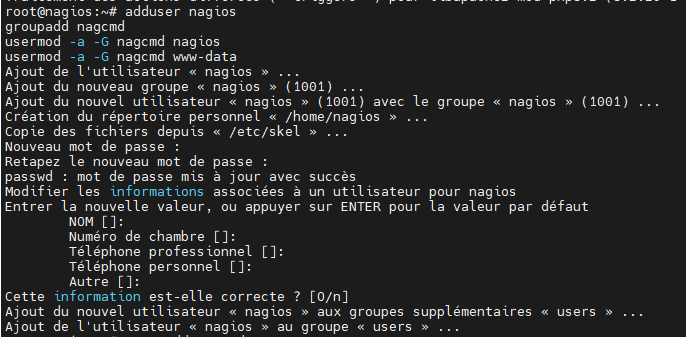

### 19.2 Téléchargement et Installation de Nagios Core Service

On télécharge la version 4.5.9 de Nagios directement depuis leur site officiel.

A noter que le fichier qui sera téléchargé aura un nom à changer il faudra le renommer « nagios-4.5.9.tar.gz ».

```bash
cd /tmp/
wget https://go.nagios.org/get-core/4-5-9
```

```
tar xzf nagios-4.5.9.tar.gz
```

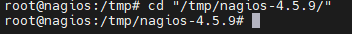

### 19.3 Compiler et installer Nagios

On configure, compile et installe Nagios avec les bonnes options pour qu’il fonctionne avec notre utilisateur, groupe, et Apache.

```bash
cd nagios-4.5.9
```

```
./configure --with-nagios-group=nagios --with-command-group=nagcmd --with-httpd_conf=/etc/apache2/sites-enabled/
make all
make install
make install-init
make install-config
make install-commandmode
make install-webconf
```

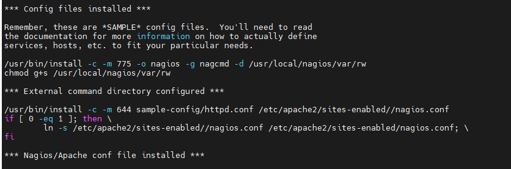

### 19.4 Créer un mot de passe pour l'accès web

Nagios utilise une authentification HTTP pour accéder à l’interface web. On définit un mot de passe pour l’utilisateur nagiosadmin.

```
htpasswd -c /usr/local/nagios/etc/htpasswd.users nagiosadmin
```

- Entrer votre mot de passe

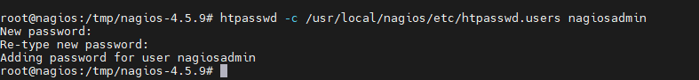

### 19.5 Configuration du site nagios sur le serveur Apache2 :

Le fonctionnement de l’interface de Nagios nécessite les scripts CGI, on les active et on redémarre Apache.

```
a2enmod cgi
```

```bash
service apache2 restart
```

### 19.6 Installer les plugins Nagios

Les plugins permettent à Nagios de tester l’état de services (ping, HTTP, SSH, etc.). On les télécharge et on les installe.

```bash
cd /tmp/
wget https://github.com/nagios-plugins/nagios-plugins/releases/download/release-2.4.12/nagios-plugins-2.4.12.tar.gz
```

```
tar xzf nagios-plugins-2.4.12.tar.gz
```

```bash
cd nagios-plugins-2.4.12
```

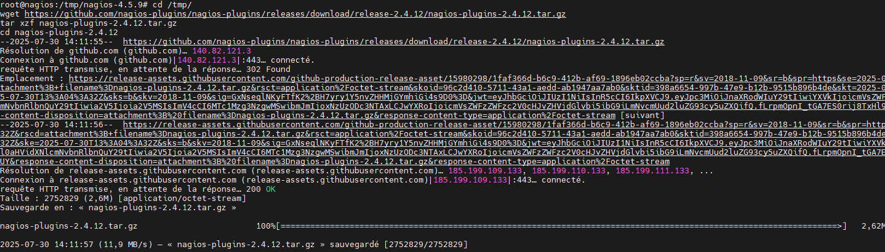

### 19.7 Compiler et installer les plugins

```
./configure --with-nagios-user=nagios --with-nagios-group=nagios --with-openssl
make
make install
```

- Si aucune erreur ne s'affiche après le make install, les plugins sont bien installés.

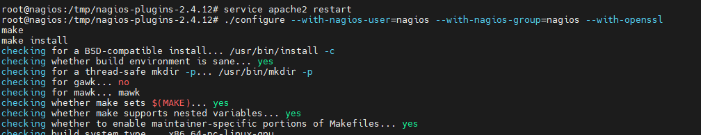

### 19.8 Démarrer et activer le service Nagios et accès à l’interface Web

On démarre ensuite le service Nagios pour qu’il commence à surveiller selon sa configuration par défaut.

```bash
service nagios start
```

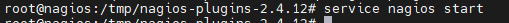

Cette commande permet de démarrer Nagios automatiquement à chaque redémarrage de la machine.

```bash
systemctl enable nagios
```

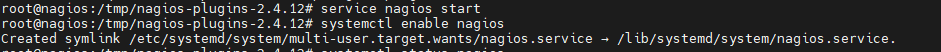

On vérifie que le service fonctionne correctement.

```bash
systemctl status nagios
```

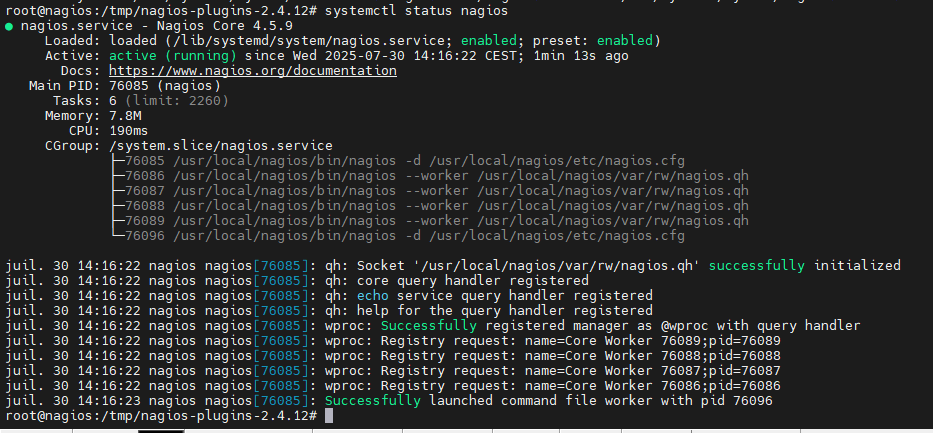

Dans un navigateur, accédez à l’adresse suivante :

```
http://10.10.10.7/nagios
```

- Utilisez nagiosadmin comme identifiant, et le mot de passe défini précédemment

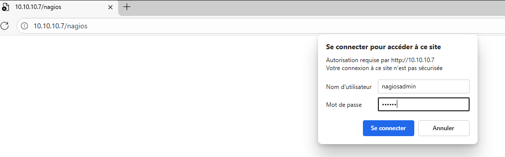

- Vous accédez enfin à l’interface Nagios

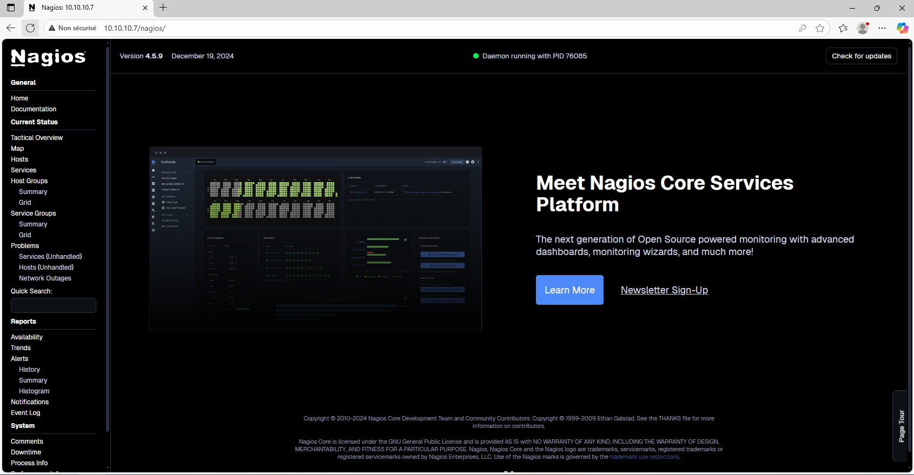

## 20. Superviser une machine distante avec NRPE

Mettre en place la supervision d’un hôte Linux à l’aide de******NRPE****.**NRPE (Nagios Remote Plugin Executor) permet à un serveur Nagios d'exécuter des commandes sur des machines distantes.

Le serveur Nagios (SRV-NAGIOS, IP : 10.10.10.7) initie les checks via NRPE vers l’hôte distant (SRV-Mail, IP : 10.10.10.4).

### 20.1 Installer les paquets requis et l’installation NRPE

Ces outils sont nécessaires pour compiler NRPE à partir du code source.

*apt**-get**install**-y**autoconf****build**-essential**gcc****make****libssl**-dev**wget*

On récupère la dernière version stable de l’agent NRPE depuis GitHub

```bash
cd /tmp
wget https://github.com/NagiosEnterprises/nrpe/releases/download/nrpe-4.1.3/nrpe-4.1.3.tar.gz
```

```
tar -zxvf nrpe-4.1.3.tar.gz
```

```bash
cd nrpe-4.1.3/
```

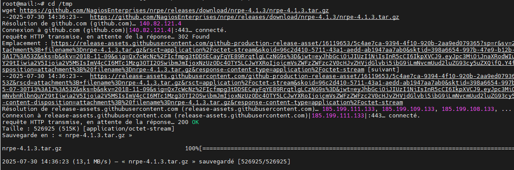

### 20.2 Compiler et installer NRPE

Ici, on configure le build avec le support des arguments, puis on compile et installe.

L'option --with-ssl-lib est nécessaire sur Debian pour que la compilation ne plante pas à cause de l’OpenSSL.

```
./configure --enable-command-args --with-ssl-lib=/usr/lib/x86_64-linux-gnu/
make all
make install-groups-users
make install
make install-config
make install-init
```

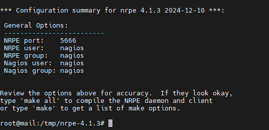

### 20.3 Modifier la configuration NRPE

```
nano /usr/local/nagios/etc/nrpe.cfg
```

Repère la ligne suivante :

```
allowed_hosts=127.0.0.1,::1
```

Et remplace-la par :

```
allowed_hosts=127.0.0.1,::1,10.10.10.7
```

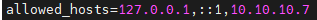

Cela autorise le serveur Nagios à interroger cette machine par NRPE.

### 20.4 Démarrer et activer le service NRPE

```bash
service nrpe start
systemctl enable nrpe
```

Vérifie le statut si besoin :

```bash
service nrpe status
```

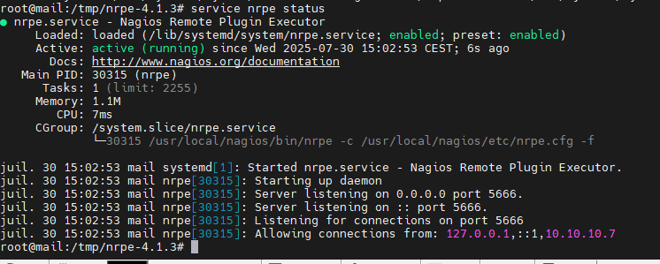

### 20.5 Installer les plugins Nagios sur SRV-Mail

Installer les dépendances pour les plugins

```bash
apt-get install -y autoconf gcc libc6 libmcrypt-dev make libssl-dev wget bc gawk dc build-essential snmp libnet-snmp-perl gettext
```

Comme pour le SRV-Nagios on va installer les plugins sur le SRV-Mail

```bash
cd /tmp/
wget https://github.com/nagios-plugins/nagios-plugins/releases/download/release-2.4.12/nagios-plugins-2.4.12.tar.gz
```

```
tar xzf nagios-plugins-2.4.12.tar.gz
```

```bash
cd nagios-plugins-2.4.12
```

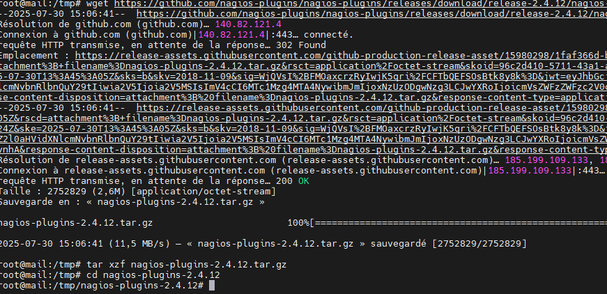

### 20.6 Compiler et installer les plugins

```
./tools/setup
./configure
make
make install
```

À la fin du make install, les plugins seront disponibles dans /usr/local/nagios/libexec.

### 20.7 Tester la communication depuis SRV-NAGIOS (10.10.10.7)

Voici les étapes **à faire sur SRV-NAGIOS (10.10.10.7)******:

Télécharger et extraire NRPE (même version : 4.1.3) :

```bash
cd /tmp
wget https://github.com/NagiosEnterprises/nrpe/releases/download/nrpe-4.1.3/nrpe-4.1.3.tar.gz
```

```
tar -zxvf nrpe-4.1.3.tar.gz
```

```bash
cd nrpe-4.1.3/
```

Compiler uniquement le plugin client (pas besoin du daemon)

```
./configure
make check_nrpe
```

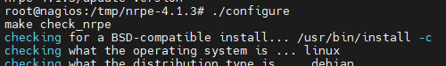

Installer le binaire check_nrpe dans le bon dossier et vérifier qu’il est bien en place

```bash
cp ./src/check_nrpe /usr/local/nagios/libexec/
ls /usr/local/nagios/libexec/check_nrpe
```

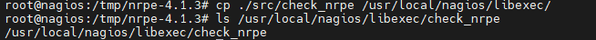

Tester que NRPE répond depuis SRV-NAGIOS

```
/usr/local/nagios/libexec/check_nrpe -H 10.10.10.4
```

Réponse attendue :

```
NRPE v4.1.3
```

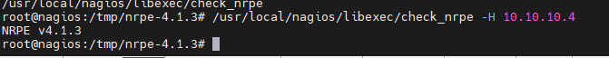

Cela confirme que la connexion réseau entre les deux machines fonctionne **et** que NRPE est actif.

### 20.8 Intégrer SRV-Mail à Nagios

On va créer un fichier de configuration dédié à SRV-Mail et l’inclure dans Nagios.

- Créer le dossier des hôtes (si ce n’est pas déjà fait)

```bash
mkdir -p /usr/local/nagios/etc/servers
```

Inclure ce dossier dans la conf principale de Nagios

Vérifie que cette ligne est bien présente dans /usr/local/nagios/etc/nagios.cfg :

```
cfg_dir=/usr/local/nagios/etc/servers
```

- Sinon, ajoute-la à la fin du fichier.

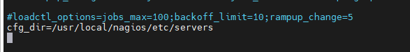

Créer le fichier srv-mail.cfg

```
nano /usr/local/nagios/etc/servers/srv-mail.cfg
```

Et ajoute le contenu suivant :

*define**host {*

***use**linux-server*

***host**_name**mail*

***alias**Serveur Mail*

***address**10.10.10.4*

*}*

*define**service {*

***use****generic**-service*

***host**_name**mail*

***service**_description**Utilisateurs connectés*

***check**_command****check_nrpe!check_users*

*}*

*define**service {*

***use****generic**-service*

***host**_name**mail*

***service**_description**Charge CPU*

***check**_command****check_nrpe!check_load*

*}*

*define**service {*

***use****generic**-service*

***host**_name**mail*

***service**_description**Espace disque /*

***check**_command****check_nrpe!check_disk*

- *}*

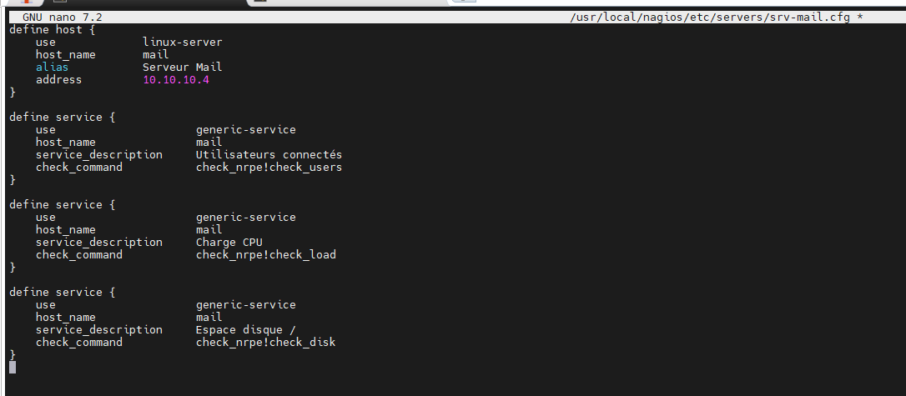

Définir la commande check_nrpe dans Nagios dans commands.cfg

```
nano /usr/local/nagios/etc/objects/commands.cfg
```

Ajoute à la fin :

```
define command {
command_name check_nrpe
command_line $USER1$/check_nrpe -H $HOSTADDRESS$ -c $ARG1$
}
```

### 20.9 Vérifier la configuration et relancer Nagios

```
/usr/local/nagios/bin/nagios -v /usr/local/nagios/etc/nagios.cfg
```

```bash
systemctl restart nagios
```

### 20.10 Résultat attendu

Dans l’interface Web de Nagios (http://10.10.10.7/nagios), l’hôte mail apparaît.

Tu vois les états de :

```
Utilisateurs connectés
Charge CPU
Espace disque /
```

- Tous les checks NRPE fonctionnent avec les plugins locaux de SRV-Mail.

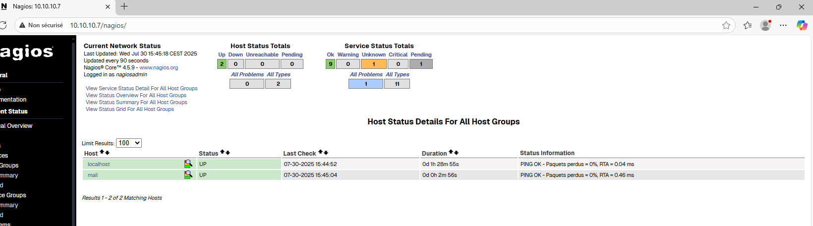

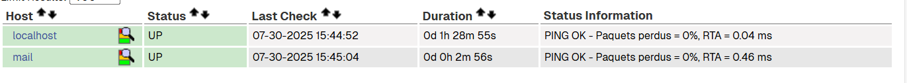
